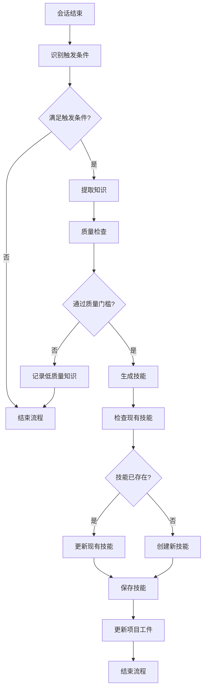

# Claudeception适配技能

## 技能概述

本技能适配Claudeception核心功能到Trae IDE，实现从工作会话中提取可重用知识并转化为技能。基于abhattacherjee/claudeception优化而来，针对标书编写项目定制。

---

## 核心功能

### 1. 触发条件识别

**功能描述：** 识别何时应该提取知识为技能

**触发条件：**
```markdown
# 触发条件

## 自动触发
- 完成非显而易见的调试
- 通过调查或试错找到解决方案
- 解决根原因不明显的错误
- 通过调查学习项目特定模式

## 显式触发
- 用户请求保存为技能
- 用户使用/claudeception命令
- 用户说"保存我们刚学到的"

## 质量门槛
- 解决方案经过验证
- 解决方案可重用
- 解决方案有清晰触发条件
- 解决方案有助于未来任务
```

**识别算法：**
```python
def identify_triggers(session_data):
    """
    识别触发条件
    
    Args:
        session_data: 会话数据
        
    Returns:
        触发条件列表
    """
    triggers = []
    
    # 检查调试完成
    if is_debugging_completed(session_data):
        triggers.append({
            "type": "auto",
            "condition": "debugging_completed",
            "description": "完成非显而易见的调试",
            "confidence": 0.9
        })
    
    # 检查解决方案发现
    if is_solution_found(session_data):
        triggers.append({
            "type": "auto",
            "condition": "solution_found",
            "description": "通过调查找到解决方案",
            "confidence": 0.85
        })
    
    # 检查模式学习
    if is_pattern_learned(session_data):
        triggers.append({
            "type": "auto",
            "condition": "pattern_learned",
            "description": "学习项目特定模式",
            "confidence": 0.8
        })
    
    # 检查用户显式请求
    if is_explicit_request(session_data):
        triggers.append({
            "type": "explicit",
            "condition": "user_request",
            "description": "用户请求保存为技能",
            "confidence": 1.0
        })
    
    return triggers

def is_debugging_completed(session_data):
    """检查是否完成调试"""
    # 检查是否有错误解决
    errors = session_data.get("errors", [])
    resolved_errors = [e for e in errors if e.get("resolved", False)]
    
    # 检查解决方案是否非显而易见
    if len(resolved_errors) > 0:
        for error in resolved_errors:
            if not is_obvious_solution(error):
                return True
    
    return False

def is_solution_found(session_data):
    """检查是否找到解决方案"""
    # 检查是否有调查过程
    investigations = session_data.get("investigations", [])
    
    # 检查是否有试错过程
    trials = session_data.get("trials", [])
    
    # 检查是否有最终解决方案
    solutions = session_data.get("solutions", [])
    
    return len(investigations) > 0 or len(trials) > 0 or len(solutions) > 0

def is_pattern_learned(session_data):
    """检查是否学习到模式"""
    # 检查是否有模式识别
    patterns = session_data.get("patterns", [])
    
    # 检查模式是否项目特定
    project_specific = [p for p in patterns if p.get("project_specific", False)]
    
    return len(project_specific) > 0

def is_explicit_request(session_data):
    """检查是否有显式请求"""
    messages = session_data.get("messages", [])
    
    # 检查用户消息
    for msg in messages:
        if msg.get("role") == "user":
            content = msg.get("content", "")
            
            # 检查触发关键词
            if any(kw in content.lower() for kw in [
                "保存为技能",
                "save as skill",
                "/claudeception",
                "保存我们刚学到的"
            ]):
                return True
    
    return False
```

### 2. 知识提取

**功能描述：** 从会话中提取有价值的知识

**提取类型：**
```markdown
# 知识提取类型

## 问题解决知识
- 问题描述
- 根本原因
- 解决方案
- 验证方法

## 模式知识
- 模式描述
- 触发条件
- 应用场景
- 预期效果

## 工作流知识
- 工作流步骤
- 最佳实践
- 常见陷阱
- 优化建议

## 配置知识
- 配置项
- 配置值
- 配置原因
- 配置影响
```

**提取算法：**
```python
def extract_knowledge(session_data):
    """
    提取知识
    
    Args:
        session_data: 会话数据
        
    Returns:
        提取的知识
    """
    knowledge = {
        "problem_solutions": extract_problem_solutions(session_data),
        "patterns": extract_patterns(session_data),
        "workflows": extract_workflows(session_data),
        "configurations": extract_configurations(session_data)
    }
    
    # 评估知识质量
    evaluated_knowledge = evaluate_knowledge(knowledge)
    
    return evaluated_knowledge

def extract_problem_solutions(session_data):
    """提取问题解决方案"""
    solutions = []
    
    # 提取错误和解决方案
    errors = session_data.get("errors", [])
    for error in errors:
        if error.get("resolved", False):
            solution = {
                "problem": error.get("description"),
                "root_cause": error.get("root_cause"),
                "solution": error.get("solution"),
                "verification": error.get("verification"),
                "context": error.get("context"),
                "applicability": error.get("applicability", "general")
            }
            solutions.append(solution)
    
    return solutions

def extract_patterns(session_data):
    """提取模式"""
    patterns = []
    
    # 提取识别的模式
    identified_patterns = session_data.get("patterns", [])
    for pattern in identified_patterns:
        pattern_knowledge = {
            "pattern": pattern.get("description"),
            "trigger_conditions": pattern.get("triggers", []),
            "application_scenarios": pattern.get("scenarios", []),
            "expected_outcome": pattern.get("outcome"),
            "examples": pattern.get("examples", [])
        }
        patterns.append(pattern_knowledge)
    
    return patterns

def extract_workflows(session_data):
    """提取工作流"""
    workflows = []
    
    # 提取成功的工作流
    successful_workflows = session_data.get("workflows", [])
    for workflow in successful_workflows:
        if workflow.get("success", False):
            workflow_knowledge = {
                "name": workflow.get("name"),
                "steps": workflow.get("steps", []),
                "best_practices": workflow.get("best_practices", []),
                "common_pitfalls": workflow.get("pitfalls", []),
                "optimizations": workflow.get("optimizations", [])
            }
            workflows.append(workflow_knowledge)
    
    return workflows

def extract_configurations(session_data):
    """提取配置"""
    configurations = []
    
    # 提取有效的配置
    valid_configs = session_data.get("configurations", [])
    for config in valid_configs:
        if config.get("validated", False):
            config_knowledge = {
                "name": config.get("name"),
                "value": config.get("value"),
                "reason": config.get("reason"),
                "impact": config.get("impact"),
                "context": config.get("context")
            }
            configurations.append(config_knowledge)
    
    return configurations
```

### 3. 质量检查

**功能描述：** 检查提取的知识是否满足质量门槛

**质量标准：**
```json
{
  "quality_gates": {
    "verification": {
      "description": "解决方案经过验证",
      "threshold": 1.0,
      "weight": 0.30
    },
    "reusability": {
      "description": "解决方案可重用",
      "threshold": 0.8,
      "weight": 0.25
    },
    "clarity": {
      "description": "有清晰触发条件",
      "threshold": 0.8,
      "weight": 0.20
    },
    "value": {
      "description": "有助于未来任务",
      "threshold": 0.7,
      "weight": 0.15
    },
    "uniqueness": {
      "description": "不与现有技能重复",
      "threshold": 0.9,
      "weight": 0.10
    }
  }
}
```

**检查算法：**
```python
def check_quality_gates(knowledge):
    """
    检查质量门槛
    
    Args:
        knowledge: 提取的知识
        
    Returns:
        质量检查结果
    """
    results = {
        "verification": check_verification(knowledge),
        "reusability": check_reusability(knowledge),
        "clarity": check_clarity(knowledge),
        "value": check_value(knowledge),
        "uniqueness": check_uniqueness(knowledge)
    }
    
    # 计算总体得分
    total_score = 0.0
    weights = {
        "verification": 0.30,
        "reusability": 0.25,
        "clarity": 0.20,
        "value": 0.15,
        "uniqueness": 0.10
    }
    
    for gate, weight in weights.items():
        total_score += results[gate]["score"] * weight
    
    results["overall_score"] = total_score
    results["passes_gates"] = total_score >= 0.8
    
    return results

def check_verification(knowledge):
    """检查验证"""
    # 检查是否有验证方法
    if "verification" not in knowledge:
        return {
            "score": 0.0,
            "status": "fail",
            "message": "缺少验证方法"
        }
    
    verification = knowledge["verification"]
    
    # 检查验证是否明确
    if not verification or verification == "未验证":
        return {
            "score": 0.0,
            "status": "fail",
            "message": "验证方法不明确"
        }
    
    return {
        "score": 1.0,
        "status": "pass",
        "message": "验证方法明确"
    }

def check_reusability(knowledge):
    """检查可重用性"""
    # 检查是否有触发条件
    if "trigger_conditions" not in knowledge:
        return {
            "score": 0.5,
            "status": "warning",
            "message": "缺少触发条件"
        }
    
    triggers = knowledge["trigger_conditions"]
    
    # 检查触发条件是否具体
    if not triggers or len(triggers) == 0:
        return {
            "score": 0.3,
            "status": "fail",
            "message": "触发条件不具体"
        }
    
    return {
        "score": 0.9,
        "status": "pass",
        "message": "触发条件具体明确"
    }

def check_clarity(knowledge):
    """检查清晰度"""
    # 检查描述是否清晰
    if "description" not in knowledge:
        return {
            "score": 0.0,
            "status": "fail",
            "message": "缺少描述"
        }
    
    description = knowledge["description"]
    
    # 检查描述长度
    if len(description) < 20:
        return {
            "score": 0.5,
            "status": "warning",
            "message": "描述过于简短"
        }
    
    return {
        "score": 0.9,
        "status": "pass",
        "message": "描述清晰明确"
    }

def check_value(knowledge):
    """检查价值"""
    # 检查应用场景
    if "application_scenarios" not in knowledge:
        return {
            "score": 0.6,
            "status": "warning",
            "message": "缺少应用场景"
        }
    
    scenarios = knowledge["application_scenarios"]
    
    # 检查场景数量
    if len(scenarios) < 2:
        return {
            "score": 0.7,
            "status": "warning",
            "message": "应用场景较少"
        }
    
    return {
        "score": 0.9,
        "status": "pass",
        "message": "应用场景丰富"
    }

def check_uniqueness(knowledge):
    """检查唯一性"""
    # 检查是否与现有技能重复
    existing_skills = get_existing_skills()
    
    for skill in existing_skills:
        if is_similar(knowledge, skill):
            return {
                "score": 0.3,
                "status": "fail",
                "message": f"与现有技能'{skill['name']}'重复"
            }
    
    return {
        "score": 1.0,
        "status": "pass",
        "message": "技能唯一"
    }
```

### 4. 技能生成

**功能描述：** 将通过质量检查的知识转化为技能

**生成流程：**
```python
def generate_skill(knowledge, quality_results):
    """
    生成技能
    
    Args:
        knowledge: 提取的知识
        quality_results: 质量检查结果
        
    Returns:
        技能数据
    """
    # 检查是否通过质量门槛
    if not quality_results["passes_gates"]:
        return None
    
    # 生成技能名称
    skill_name = generate_skill_name(knowledge)
    
    # 生成技能描述
    skill_description = generate_skill_description(knowledge)
    
    # 生成触发条件
    triggers = generate_triggers(knowledge)
    
    # 生成行动
    actions = generate_actions(knowledge)
    
    # 构建技能数据
    skill_data = {
        "metadata": {
            "name": skill_name,
            "description": skill_description,
            "version": "1.0.0",
            "created_at": datetime.now().isoformat(),
            "source": "claudeception"
        },
        "triggers": triggers,
        "actions": actions,
        "quality_score": quality_results["overall_score"],
        "knowledge": knowledge
    }
    
    return skill_data

def generate_skill_name(knowledge):
    """生成技能名称"""
    # 根据知识类型生成名称
    if "problem" in knowledge and "solution" in knowledge:
        # 问题解决型
        problem = knowledge["problem"]
        return f"解决_{problem[:20]}"
    elif "pattern" in knowledge:
        # 模式型
        pattern = knowledge["pattern"]
        return f"模式_{pattern[:20]}"
    elif "workflow" in knowledge:
        # 工作流型
        workflow = knowledge["workflow"]
        return f"工作流_{workflow[:20]}"
    else:
        # 通用型
        return "自定义技能"

def generate_skill_description(knowledge):
    """生成技能描述"""
    # 根据知识类型生成描述
    if "problem" in knowledge and "solution" in knowledge:
        return f"解决{knowledge['problem']}的技能"
    elif "pattern" in knowledge:
        return f"应用{knowledge['pattern']}模式的技能"
    elif "workflow" in knowledge:
        return f"执行{knowledge['workflow']}工作流的技能"
    else:
        return "自定义技能"

def generate_triggers(knowledge):
    """生成触发条件"""
    triggers = []
    
    # 从知识中提取触发条件
    if "trigger_conditions" in knowledge:
        triggers.extend(knowledge["trigger_conditions"])
    
    # 添加通用触发条件
    if "problem" in knowledge:
        triggers.append(f"遇到{knowledge['problem']}")
    
    if "pattern" in knowledge:
        triggers.append(f"检测到{knowledge['pattern']}模式")
    
    return triggers

def generate_actions(knowledge):
    """生成行动"""
    actions = []
    
    # 从知识中提取行动步骤
    if "solution" in knowledge:
        actions.append({
            "step": 1,
            "action": "应用解决方案",
            "description": knowledge["solution"]
        })
    
    if "verification" in knowledge:
        actions.append({
            "step": 2,
            "action": "验证结果",
            "description": knowledge["verification"]
        })
    
    return actions
```

---

## 工作流程

### Claudeception流程



---

## 配置参数

```json
{
  "skill_name": "Claudeception适配",
  "skill_version": "1.0.0",
  "enabled": true,
  "config": {
    "auto_extract": true,
    "extract_interval": "on_session_end",
    "quality_threshold": 0.8,
    "auto_create": true,
    "auto_update": true,
    "check_existing": true,
    "update_artifacts": true
  },
  "triggers": {
    "auto_triggers": [
      "debugging_completed",
      "solution_found",
      "pattern_learned"
    ],
    "explicit_triggers": [
      "/claudeception",
      "save as skill",
      "保存为技能"
    ]
  },
  "quality_gates": {
    "verification": {
      "enabled": true,
      "threshold": 1.0,
      "weight": 0.30
    },
    "reusability": {
      "enabled": true,
      "threshold": 0.8,
      "weight": 0.25
    },
    "clarity": {
      "enabled": true,
      "threshold": 0.8,
      "weight": 0.20
    },
    "value": {
      "enabled": true,
      "threshold": 0.7,
      "weight": 0.15
    },
    "uniqueness": {
      "enabled": true,
      "threshold": 0.9,
      "weight": 0.10
    }
  },
  "storage": {
    "skills_dir": ".skills/generated",
    "knowledge_dir": ".learning/knowledge",
    "metadata_file": ".learning/claudeception.json"
  }
}
```

---

## 使用示例

### 示例1：自动提取调试知识

**场景：** 用户完成了一个复杂的调试任务

**会话数据：**
```json
{
  "errors": [
    {
      "description": "python-docx库读取中文文件乱码",
      "root_cause": "未指定编码参数",
      "solution": "使用encoding='utf-8'参数",
      "verification": "成功读取中文内容",
      "context": "读取天津背街小巷项目文档",
      "resolved": true
    }
  ],
  "patterns": [],
  "workflows": [],
  "configurations": []
}
```

**执行过程：**
```python
# 1. 识别触发条件
triggers = identify_triggers(session_data)
# 结果：[{"type": "auto", "condition": "debugging_completed"}]

# 2. 提取知识
knowledge = extract_knowledge(session_data)

# 3. 质量检查
quality_results = check_quality_gates(knowledge)
# 结果：{"overall_score": 0.95, "passes_gates": true}

# 4. 生成技能
skill = generate_skill(knowledge, quality_results)
```

**生成的技能：**
```markdown
# 解决python-docx中文乱码

## 技能描述
解决python-docx库读取中文文件时出现的乱码问题

## 触发条件
- 使用python-docx读取中文文件
- 遇到中文内容乱码
- 文件编码为UTF-8

## 行动
1. 使用encoding='utf-8'参数打开文件
2. 使用Document(file_path, encoding='utf-8')读取
3. 验证中文内容正确显示

## 质量得分
0.95（通过所有质量门槛）
```

---

## 性能指标

### 提取效率
- **触发识别速度：** ≥ 100会话/秒
- **知识提取速度：** ≥ 10知识/秒
- **质量检查速度：** ≥ 100检查/秒
- **技能生成速度：** ≥ 5技能/秒

### 提取质量
- **触发识别准确率：** ≥ 90%
- **知识提取准确率：** ≥ 85%
- **质量检查准确率：** ≥ 90%
- **技能生成成功率：** ≥ 80%

---

**技能版本：** V1.0
**最后更新：** 2026年3月13日
**维护人员：** AI助手
**来源参考：** abhattacherjee/claudeception
