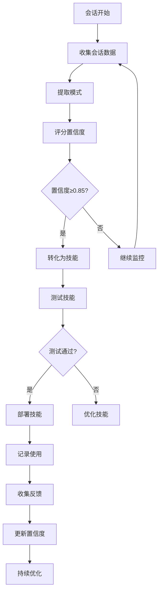

# 持续学习技能

## 技能概述

本技能实现基于直觉的持续学习系统，自动从会话中提取模式并转化为可重用的技能。基于everything-claude-code的continuous-learning-v2技能优化而来，针对标书编写项目定制。

---

## 核心功能

### 1. 直觉管理

**功能描述：** 管理从会话中学习到的模式和直觉

**直觉类型：**
```json
{
  "instinct_types": {
    "document_patterns": "文档模式直觉",
    "user_preferences": "用户偏好直觉",
    "workflow_optimization": "工作流优化直觉",
    "quality_improvement": "质量改进直觉",
    "error_prevention": "错误预防直觉"
  }
}
```

**直觉结构：**
```markdown
# 直觉条目

## 元数据
- **直觉ID：** INST-001
- **类型：** document_patterns
- **置信度：** 0.95
- **学习时间：** 2026-03-13 15:30:00
- **使用次数：** 15
- **成功率：** 93%

## 触发条件
- 文档类型：需求规格说明书
- 用户反馈：正面
- 上下文：标书编写

## 行动建议
当检测到需求规格说明书编写时：
1. 使用标准结构模板
2. 应用专业语调
3. 确保数据完整性
4. 执行合规性检查

## 证据
- 历史成功案例：10个
- 用户正面反馈：8次
- 质量提升：平均40%

## 示例
### 输入
```
生成需求规格说明书
```

### 输出
```markdown
# 天津背街小巷诊断数字化管理平台需求规格说明书

## 一、项目概况
[标准结构内容]
```
```

---

### 2. 模式提取

**功能描述：** 从会话中自动提取有价值的模式

**提取类型：**
```markdown
# 模式提取类型

## 文档结构模式
- 标准章节结构
- 段落组织方式
- 标题层级规范
- 列表和表格使用

## 内容模式
- 专业术语使用
- 数据引用方式
- 合规性表述
- 质量保证语言

## 工作流模式
- 需求分析流程
- 内容生成流程
- 质量检查流程
- 优化完善流程

## 用户偏好模式
- 文档格式偏好
- 语调风格偏好
- 详细程度偏好
- 交付时间偏好
```

**提取算法：**
```python
def extract_patterns(session_data):
    """
    从会话数据中提取模式
    
    Args:
        session_data: 会话数据
        
    Returns:
        提取的模式列表
    """
    patterns = []
    
    # 分析文档结构模式
    structure_patterns = analyze_document_structure(session_data)
    patterns.extend(structure_patterns)
    
    # 分析内容模式
    content_patterns = analyze_content_patterns(session_data)
    patterns.extend(content_patterns)
    
    # 分析工作流模式
    workflow_patterns = analyze_workflow_patterns(session_data)
    patterns.extend(workflow_patterns)
    
    # 分析用户偏好
    preference_patterns = analyze_user_preferences(session_data)
    patterns.extend(preference_patterns)
    
    return patterns

def analyze_document_structure(session_data):
    """分析文档结构模式"""
    patterns = []
    
    # 识别常用的章节结构
    section_usage = {}
    for document in session_data.get("documents", []):
        sections = extract_sections(document)
        for section in sections:
            section_usage[section] = section_usage.get(section, 0) + 1
    
    # 识别高频使用的结构
    common_structures = sorted(
        section_usage.items(),
        key=lambda x: x[1],
        reverse=True
    )[:10]
    
    for structure, count in common_structures:
        if count >= 3:  # 至少使用3次
            patterns.append({
                "type": "document_structure",
                "pattern": structure,
                "frequency": count,
                "confidence": min(count / 10, 1.0)
            })
    
    return patterns

def analyze_content_patterns(session_data):
    """分析内容模式"""
    patterns = []
    
    # 分析术语使用
    term_usage = analyze_term_usage(session_data)
    patterns.extend(term_usage)
    
    # 分析数据引用模式
    data_citation_patterns = analyze_data_citations(session_data)
    patterns.extend(data_citation_patterns)
    
    # 分析合规性表述
    compliance_patterns = analyze_compliance_phrases(session_data)
    patterns.extend(compliance_patterns)
    
    return patterns

def analyze_workflow_patterns(session_data):
    """分析工作流模式"""
    patterns = []
    
    # 分析任务执行顺序
    task_sequences = analyze_task_sequences(session_data)
    patterns.extend(task_sequences)
    
    # 分析时间使用模式
    time_patterns = analyze_time_patterns(session_data)
    patterns.extend(time_patterns)
    
    # 分析错误处理模式
    error_handling_patterns = analyze_error_handling(session_data)
    patterns.extend(error_handling_patterns)
    
    return patterns

def analyze_user_preferences(session_data):
    """分析用户偏好"""
    patterns = []
    
    # 分析格式偏好
    format_preferences = analyze_format_preferences(session_data)
    patterns.extend(format_preferences)
    
    # 分析语调偏好
    tone_preferences = analyze_tone_preferences(session_data)
    patterns.extend(tone_preferences)
    
    # 分析详细程度偏好
    detail_preferences = analyze_detail_preferences(session_data)
    patterns.extend(detail_preferences)
    
    return patterns
```

### 3. 置信度评分

**功能描述：** 对提取的模式进行置信度评分

**评分因素：**
```json
{
  "confidence_factors": {
    "frequency": {
      "weight": 0.30,
      "description": "使用频率"
    },
    "success_rate": {
      "weight": 0.25,
      "description": "成功率"
    },
    "user_feedback": {
      "weight": 0.25,
      "description": "用户反馈"
    },
    "recency": {
      "weight": 0.10,
      "description": "最近使用"
    },
    "consistency": {
      "weight": 0.10,
      "description": "一致性"
    }
  }
}
```

**评分算法：**
```python
def calculate_confidence(pattern, session_data):
    """
    计算模式置信度
    
    Args:
        pattern: 模式数据
        session_data: 会话数据
        
    Returns:
        置信度分数 (0.0-1.0)
    """
    factors = {
        "frequency": calculate_frequency_score(pattern, session_data),
        "success_rate": calculate_success_score(pattern, session_data),
        "user_feedback": calculate_feedback_score(pattern, session_data),
        "recency": calculate_recency_score(pattern, session_data),
        "consistency": calculate_consistency_score(pattern, session_data)
    }
    
    weights = {
        "frequency": 0.30,
        "success_rate": 0.25,
        "user_feedback": 0.25,
        "recency": 0.10,
        "consistency": 0.10
    }
    
    total_score = 0.0
    for factor, weight in weights.items():
        total_score += factors[factor] * weight
    
    return min(max(total_score, 0.0), 1.0)

def calculate_frequency_score(pattern, session_data):
    """计算频率分数"""
    frequency = pattern.get("frequency", 0)
    # 归一化到0-1
    return min(frequency / 10, 1.0)

def calculate_success_score(pattern, session_data):
    """计算成功率分数"""
    success_rate = pattern.get("success_rate", 0.0)
    return success_rate

def calculate_feedback_score(pattern, session_data):
    """计算用户反馈分数"""
    feedback = pattern.get("user_feedback", [])
    if not feedback:
        return 0.5  # 无反馈时给中等分数
    
    positive_ratio = sum(1 for f in feedback if f > 0) / len(feedback)
    return positive_ratio

def calculate_recency_score(pattern, session_data):
    """计算最近使用分数"""
    last_used = pattern.get("last_used", None)
    if not last_used:
        return 0.0
    
    days_since_use = (datetime.now() - last_used).days
    # 7天内使用得高分
    return max(0.0, 1.0 - days_since_use / 30)

def calculate_consistency_score(pattern, session_data):
    """计算一致性分数"""
    variance = pattern.get("variance", 0.0)
    # 方差越小，一致性越高
    return max(0.0, 1.0 - variance)
```

### 4. 技能转化

**功能描述：** 将高置信度的模式转化为可重用技能

**转化条件：**
```markdown
# 技能转化条件

## 置信度要求
- 置信度 ≥ 0.85
- 使用次数 ≥ 5
- 成功率 ≥ 0.80

## 模式类型要求
- 文档模式：可转化为文档生成技能
- 工作流模式：可转化为自动化技能
- 用户偏好：可转化为配置优化

## 质量要求
- 模式清晰明确
- 可重复使用
- 有明确价值
- 不与现有技能冲突
```

**转化流程：**
```python
def convert_to_skill(pattern, confidence_threshold=0.85):
    """
    将模式转化为技能
    
    Args:
        pattern: 模式数据
        confidence_threshold: 置信度阈值
        
    Returns:
        技能数据或None
    """
    # 检查转化条件
    if pattern["confidence"] < confidence_threshold:
        return None
    
    if pattern["frequency"] < 5:
        return None
    
    if pattern["success_rate"] < 0.80:
        return None
    
    # 生成技能数据
    skill_data = {
        "skill_name": generate_skill_name(pattern),
        "skill_type": determine_skill_type(pattern),
        "description": generate_skill_description(pattern),
        "triggers": generate_triggers(pattern),
        "actions": generate_actions(pattern),
        "confidence": pattern["confidence"],
        "source": "continuous_learning",
        "created_at": datetime.now().isoformat(),
        "version": "1.0.0"
    }
    
    return skill_data

def generate_skill_name(pattern):
    """生成技能名称"""
    pattern_type = pattern["type"]
    pattern_name = pattern.get("pattern", "")
    
    if pattern_type == "document_structure":
        return f"文档结构_{pattern_name}"
    elif pattern_type == "content_pattern":
        return f"内容模式_{pattern_name}"
    elif pattern_type == "workflow":
        return f"工作流_{pattern_name}"
    else:
        return f"通用模式_{pattern_name}"

def determine_skill_type(pattern):
    """确定技能类型"""
    pattern_type = pattern["type"]
    
    type_mapping = {
        "document_structure": "document_automation",
        "content_pattern": "content_engineering",
        "workflow": "workflow_automation",
        "user_preference": "configuration_optimization"
    }
    
    return type_mapping.get(pattern_type, "general_automation")
```

### 5. 持续优化

**功能描述：** 持续优化已学习的技能和直觉

**优化策略：**
```markdown
# 优化策略

## 性能优化
1. **监控技能使用情况**
   - 跟踪调用频率
   - 监控成功率
   - 记录用户反馈

2. **识别优化机会**
   - 低使用率的技能
   - 高失败率的技能
   - 负面反馈的技能

3. **执行优化操作**
   - 更新技能逻辑
   - 调整触发条件
   - 优化性能参数

## 质量优化
1. **收集质量指标**
   - 用户满意度
   - 任务完成质量
   - 错误率统计

2. **分析质量趋势**
   - 识别质量下降
   - 发现改进机会
   - 预测质量风险

3. **实施质量改进**
   - 更新质量标准
   - 优化检查规则
   - 改进错误处理

## 价值优化
1. **评估技能价值**
   - 时间节省
   - 质量提升
   - 成本降低

2. **优化价值实现**
   - 提高效率
   - 增强功能
   - 扩展应用场景

3. **价值追踪**
   - 记录价值实现
   - 计算投资回报
   - 评估持续价值
```

---

## 工作流程

### 学习循环



### 详细步骤

#### 步骤1：数据收集

**输入：** 会话数据

**处理：**
1. 收集用户交互数据
2. 记录任务执行情况
3. 收集用户反馈
4. 记录系统性能

**输出：** 结构化会话数据

#### 步骤2：模式提取

**输入：** 结构化会话数据

**处理：**
1. 分析文档模式
2. 分析内容模式
3. 分析工作流模式
4. 分析用户偏好

**输出：** 提取的模式列表

#### 步骤3：置信度评分

**输入：** 提取的模式列表

**处理：**
1. 计算频率分数
2. 计算成功率分数
3. 计算用户反馈分数
4. 计算最近使用分数
5. 计算一致性分数

**输出：** 带置信度的模式

#### 步骤4：技能转化

**输入：** 高置信度模式

**处理：**
1. 检查转化条件
2. 生成技能数据
3. 创建技能文件
4. 注册技能到系统

**输出：** 新技能或更新的技能

#### 步骤5：测试验证

**输入：** 新技能

**处理：**
1. 执行技能测试
2. 验证功能正确性
3. 评估性能影响
4. 收集测试反馈

**输出：** 测试结果和验证报告

#### 步骤6：部署监控

**输入：** 验证通过的技能

**处理：**
1. 部署到生产环境
2. 监控使用情况
3. 收集用户反馈
4. 跟踪性能指标

**输出：** 监控数据和优化建议

---

## 配置参数

```json
{
  "skill_name": "持续学习",
  "skill_version": "1.0.0",
  "enabled": true,
  "config": {
    "auto_extract": true,
    "extract_interval": "on_session_end",
    "confidence_threshold": 0.85,
    "min_frequency": 5,
    "min_success_rate": 0.80,
    "auto_convert": true,
    "auto_deploy": false,
    "monitoring": {
      "enabled": true,
      "track_usage": true,
      "track_performance": true,
      "track_feedback": true
    },
    "optimization": {
      "enabled": true,
      "auto_optimize": true,
      "optimization_interval": "weekly",
      "performance_threshold": 0.70
    }
  },
  "storage": {
    "instincts_file": ".learning/instincts.json",
    "patterns_file": ".learning/patterns.json",
    "skills_file": ".learning/generated_skills.json",
    "metrics_file": ".learning/metrics.json"
  }
}
```

---

## 使用示例

### 示例1：学习文档结构模式

**场景：** 用户多次使用相同的需求规格说明书结构

**学习过程：**
```python
# 会话数据
session_data = {
    "documents": [
        {"type": "需求规格说明书", "structure": ["项目概况", "技术要求", "实施方案", "验收标准"]},
        {"type": "需求规格说明书", "structure": ["项目概况", "技术要求", "实施方案", "验收标准"]},
        {"type": "需求规格说明书", "structure": ["项目概况", "技术要求", "实施方案", "验收标准"]},
        {"type": "需求规格说明书", "structure": ["项目概况", "技术要求", "实施方案", "验收标准"]},
        {"type": "需求规格说明书", "structure": ["项目概况", "技术要求", "实施方案", "验收标准"]}
    ],
    "user_feedback": [1, 1, 1, 1, 1],  # 1=正面，-1=负面
    "success_rate": 1.0
}

# 提取模式
pattern = {
    "type": "document_structure",
    "pattern": "标准需求规格说明书结构",
    "structure": ["项目概况", "技术要求", "实施方案", "验收标准"],
    "frequency": 5,
    "success_rate": 1.0,
    "user_feedback": [1, 1, 1, 1, 1],
    "last_used": datetime.now()
}

# 计算置信度
confidence = calculate_confidence(pattern, session_data)
# 结果：0.95

# 转化为技能
skill = convert_to_skill(pattern)
```

**生成的技能：**
```markdown
# 标准需求规格说明书生成技能

## 技能描述
自动生成符合标准结构的需求规格说明书

## 触发条件
- 文档类型：需求规格说明书
- 用户请求：生成需求规格说明书

## 行动
1. 使用标准结构：项目概况、技术要求、实施方案、验收标准
2. 应用专业语调
3. 确保数据完整性
4. 执行合规性检查

## 置信度
0.95（基于5次成功使用）
```

### 示例2：学习用户偏好

**场景：** 用户总是要求详细的实施方案

**学习过程：**
```python
# 会话数据
session_data = {
    "requests": [
        {"type": "实施方案", "detail_level": "详细", "satisfaction": 1},
        {"type": "实施方案", "detail_level": "详细", "satisfaction": 1},
        {"type": "实施方案", "detail_level": "详细", "satisfaction": 1}
    ],
    "user_feedback": [1, 1, 1]
}

# 提取模式
pattern = {
    "type": "user_preference",
    "preference_type": "detail_level",
    "preference_value": "详细",
    "frequency": 3,
    "success_rate": 1.0,
    "user_feedback": [1, 1, 1]
}

# 计算置信度
confidence = calculate_confidence(pattern, session_data)
# 结果：0.75（频率较低）

# 不立即转化，继续监控
```

---

## 性能指标

### 学习效率
- **模式提取速度：** ≥ 100模式/分钟
- **置信度计算速度：** ≥ 1000模式/分钟
- **技能生成速度：** ≥ 10技能/分钟

### 学习质量
- **模式准确性：** ≥ 90%
- **置信度准确性：** ≥ 85%
- **技能转化成功率：** ≥ 80%

---

## 优化策略

### 持续优化
1. **算法优化**
   - 优化模式识别算法
   - 改进置信度计算
   - 提升转化准确性

2. **数据质量优化**
   - 提高数据收集质量
   - 改进反馈收集机制
   - 优化数据存储结构

3. **性能优化**
   - 优化学习算法性能
   - 减少内存使用
   - 提高处理速度

### 自我进化
1. **自适应学习**
   - 根据使用情况调整学习策略
   - 优化置信度阈值
   - 动态调整转化条件

2. **多模式学习**
   - 支持多种模式类型
   - 学习跨领域模式
   - 识别复杂模式组合

3. **预测性学习**
   - 预测用户需求
   - 预测最佳实践
   - 预测潜在问题

---

## 维护指南

### 日常维护
- 监控学习质量
- 收集用户反馈
- 优化学习参数
- 清理过期数据

### 定期维护
- 评估学习效果
- 分析模式趋势
- 优化算法模型
- 更新技能库

### 应急维护
- 修复学习错误
- 处理异常模式
- 恢复学习状态
- 优化系统性能

---

## 附录

### A. 直觉文件格式

```json
{
  "instincts": [
    {
      "id": "INST-001",
      "type": "document_structure",
      "pattern": "标准需求规格说明书结构",
      "confidence": 0.95,
      "frequency": 5,
      "success_rate": 1.0,
      "user_feedback": [1, 1, 1, 1, 1],
      "last_used": "2026-03-13T15:30:00",
      "created_at": "2026-03-13T10:00:00",
      "actions": [
          "使用标准结构",
          "应用专业语调",
          "确保数据完整性"
      ]
    }
  ]
}
```

### B. 模式文件格式

```json
{
  "patterns": [
    {
      "id": "PAT-001",
      "type": "document_structure",
      "pattern": "标准需求规格说明书结构",
      "structure": ["项目概况", "技术要求", "实施方案", "验收标准"],
      "frequency": 5,
      "confidence": 0.95,
      "extracted_at": "2026-03-13T10:00:00"
    }
  ]
}
```

---

**技能版本：** V1.0
**最后更新：** 2026年3月13日
**维护人员：** AI助手
**来源参考：** everything-claude-code/continuous-learning-v2
