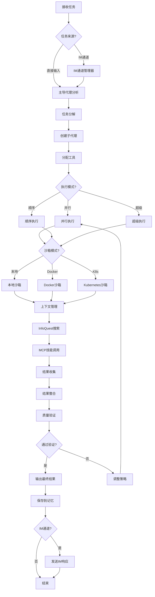

# DeerFlow 2.0适配技能

## 技能概述

本技能适配DeerFlow 2.0核心功能到Trae IDE，实现超级代理工具、子代理编排、沙箱执行、上下文工程和长期记忆。基于bytedance/deer-flow 2.0优化而来，针对标书编写项目定制。

**DeerFlow 2.0特性：**
- 完全重写的架构（与v1不共享代码）
- InfoQuest智能搜索集成
- MCP服务器支持
- IM通道支持
- 多种沙箱模式（本地、Docker、Kubernetes）

---

## 核心功能

### 1. 技能和工具系统

**功能描述：** 管理可扩展的技能和工具集

**技能类型：**
```json
{
  "skill_types": {
    "built_in": {
      "name": "内置技能",
      "skills": [
        "research",
        "report_generation",
        "slide_creation",
        "web_page",
        "image_generation",
        "video_generation"
      ]
    },
    "custom": {
      "name": "自定义技能",
      "path": ".skills/custom",
      "auto_discovery": true
    },
    "external": {
      "name": "外部技能",
      "sources": [
        "MCP servers",
        "Python functions",
        "HTTP APIs"
      ]
    }
  }
}
```

**工具管理：**
```python
class ToolManager:
    def __init__(self):
        self.built_in_tools = {
            "web_search": WebSearchTool(),
            "web_fetch": WebFetchTool(),
            "file_operations": FileOperationsTool(),
            "bash_execution": BashExecutionTool(),
            "infoquest_search": InfoQuestSearchTool()
        }
        self.custom_tools = {}
        self.mcp_tools = {}
    
    def register_tool(self, tool_name, tool_instance):
        """注册工具"""
        self.custom_tools[tool_name] = tool_instance
    
    def discover_mcp_tools(self, mcp_config):
        """发现MCP工具"""
        for server in mcp_config["servers"]:
            tools = self.connect_mcp_server(server)
            self.mcp_tools.update(tools)
    
    def get_tool(self, tool_name):
        """获取工具"""
        if tool_name in self.built_in_tools:
            return self.built_in_tools[tool_name]
        elif tool_name in self.custom_tools:
            return self.custom_tools[tool_name]
        elif tool_name in self.mcp_tools:
            return self.mcp_tools[tool_name]
        return None
    
    def list_tools(self):
        """列出所有工具"""
        all_tools = {}
        all_tools.update(self.built_in_tools)
        all_tools.update(self.custom_tools)
        all_tools.update(self.mcp_tools)
        return all_tools

class WebSearchTool:
    def execute(self, query):
        """执行网络搜索"""
        # 实现搜索逻辑
        pass

class WebFetchTool:
    def execute(self, url):
        """获取网页内容"""
        # 实现获取逻辑
        pass

class InfoQuestSearchTool:
    def __init__(self, api_key=None):
        self.api_key = api_key or os.getenv("INFOQUEST_API_KEY")
        self.base_url = "https://api.infoquest.com/v1"
    
    def execute(self, query, max_results=10):
        """
        执行InfoQuest智能搜索
        
        Args:
            query: 搜索查询
            max_results: 最大结果数
            
        Returns:
            搜索结果列表
        """
        headers = {
            "Authorization": f"Bearer {self.api_key}",
            "Content-Type": "application/json"
        }
        
        payload = {
            "query": query,
            "max_results": max_results,
            "include_crawling": True
        }
        
        response = requests.post(
            f"{self.base_url}/search",
            headers=headers,
            json=payload
        )
        
        if response.status_code == 200:
            return response.json().get("results", [])
        else:
            raise Exception(f"InfoQuest搜索失败: {response.status_code}")

class FileOperationsTool:
    def execute(self, operation, **kwargs):
        """执行文件操作"""
        # 实现文件操作逻辑
        pass

class BashExecutionTool:
    def execute(self, command):
        """执行bash命令"""
        # 实现命令执行逻辑
        pass
```

### 2. MCP服务器支持

**功能描述：** 支持可配置的MCP服务器和技能扩展

**MCP服务器配置：**
```python
class MCPServerManager:
    def __init__(self):
        self.servers = {}
        self.connections = {}
    
    def add_server(self, server_config):
        """
        添加MCP服务器
        
        Args:
            server_config: 服务器配置
                {
                    "name": "服务器名称",
                    "type": "http" | "sse",
                    "url": "服务器URL",
                    "oauth": {
                        "grant_type": "client_credentials" | "refresh_token",
                        "client_id": "客户端ID",
                        "client_secret": "客户端密钥",
                        "refresh_token": "刷新令牌"
                    },
                    "skills": ["技能列表"]
                }
        """
        server_name = server_config["name"]
        self.servers[server_name] = server_config
        
        # 连接服务器
        if server_config["type"] == "http":
            self.connect_http_server(server_config)
        elif server_config["type"] == "sse":
            self.connect_sse_server(server_config)
    
    def connect_http_server(self, config):
        """连接HTTP MCP服务器"""
        # 处理OAuth认证
        if "oauth" in config:
            token = self.get_oauth_token(config["oauth"])
            headers = {
                "Authorization": f"Bearer {token}",
                "Content-Type": "application/json"
            }
        else:
            headers = {"Content-Type": "application/json"}
        
        # 建立连接
        self.connections[config["name"]] = {
            "type": "http",
            "url": config["url"],
            "headers": headers,
            "skills": config.get("skills", [])
        }
    
    def connect_sse_server(self, config):
        """连接SSE MCP服务器"""
        # 处理OAuth认证
        if "oauth" in config:
            token = self.get_oauth_token(config["oauth"])
        
        # 建立SSE连接
        self.connections[config["name"]] = {
            "type": "sse",
            "url": config["url"],
            "token": token,
            "skills": config.get("skills", [])
        }
    
    def get_oauth_token(self, oauth_config):
        """
        获取OAuth令牌
        
        Args:
            oauth_config: OAuth配置
                
        Returns:
            访问令牌
        """
        grant_type = oauth_config["grant_type"]
        
        if grant_type == "client_credentials":
            # 客户端凭证流程
            response = requests.post(
                oauth_config["token_url"],
                data={
                    "grant_type": "client_credentials",
                    "client_id": oauth_config["client_id"],
                    "client_secret": oauth_config["client_secret"]
                }
            )
        elif grant_type == "refresh_token":
            # 刷新令牌流程
            response = requests.post(
                oauth_config["token_url"],
                data={
                    "grant_type": "refresh_token",
                    "refresh_token": oauth_config["refresh_token"]
                }
            )
        
        if response.status_code == 200:
            return response.json().get("access_token")
        else:
            raise Exception(f"OAuth认证失败: {response.status_code}")
    
    def list_server_skills(self, server_name):
        """列出服务器技能"""
        if server_name not in self.connections:
            return []
        
        return self.connections[server_name].get("skills", [])
    
    def execute_server_skill(self, server_name, skill_name, parameters):
        """执行服务器技能"""
        if server_name not in self.connections:
            raise Exception(f"服务器{server_name}未连接")
        
        connection = self.connections[server_name]
        
        if connection["type"] == "http":
            return self.execute_http_skill(connection, skill_name, parameters)
        elif connection["type"] == "sse":
            return self.execute_sse_skill(connection, skill_name, parameters)
    
    def execute_http_skill(self, connection, skill_name, parameters):
        """执行HTTP技能"""
        headers = connection["headers"]
        payload = {
            "skill": skill_name,
            "parameters": parameters
        }
        
        response = requests.post(
            f"{connection['url']}/execute",
            headers=headers,
            json=payload
        )
        
        if response.status_code == 200:
            return response.json()
        else:
            raise Exception(f"技能执行失败: {response.status_code}")
    
    def execute_sse_skill(self, connection, skill_name, parameters):
        """执行SSE技能"""
        # SSE技能执行逻辑
        pass
```

### 3. IM通道支持

**功能描述：** 支持从消息应用接收任务

**IM通道管理：**
```python
class IMChannelManager:
    def __init__(self):
        self.channels = {}
        self.active_conversations = {}
    
    def add_channel(self, channel_config):
        """
        添加IM通道
        
        Args:
            channel_config: 通道配置
                {
                    "name": "通道名称",
                    "type": "wechat" | "slack" | "discord" | "telegram",
                    "webhook_url": "Webhook URL",
                    "api_key": "API密钥",
                    "enabled": true
                }
        """
        channel_name = channel_config["name"]
        self.channels[channel_name] = channel_config
        
        # 设置Webhook
        if "webhook_url" in channel_config:
            self.setup_webhook(channel_config)
    
    def setup_webhook(self, config):
        """设置Webhook"""
        # Webhook设置逻辑
        pass
    
    def receive_message(self, channel_name, message):
        """
        接收消息
        
        Args:
            channel_name: 通道名称
            message: 消息内容
                
        Returns:
            任务ID
        """
        if channel_name not in self.channels:
            raise Exception(f"通道{channel_name}不存在")
        
        # 解析消息
        task = self.parse_message(message)
        
        # 创建任务
        task_id = self.create_task(task)
        
        # 记录对话
        self.active_conversations[task_id] = {
            "channel": channel_name,
            "message": message,
            "task_id": task_id,
            "timestamp": datetime.now().isoformat()
        }
        
        return task_id
    
    def parse_message(self, message):
        """解析消息"""
        # 消息解析逻辑
        # 识别任务类型、参数等
        return {
            "type": "task",
            "content": message,
            "parameters": {}
        }
    
    def send_response(self, task_id, response):
        """
        发送响应
        
        Args:
            task_id: 任务ID
            response: 响应内容
        """
        if task_id not in self.active_conversations:
            return
        
        conversation = self.active_conversations[task_id]
        channel_name = conversation["channel"]
        channel_config = self.channels[channel_name]
        
        # 发送响应到IM通道
        self.send_to_channel(channel_config, response)
    
    def send_to_channel(self, channel_config, message):
        """发送消息到通道"""
        # 根据通道类型发送消息
        channel_type = channel_config["type"]
        
        if channel_type == "wechat":
            self.send_wechat_message(channel_config, message)
        elif channel_type == "slack":
            self.send_slack_message(channel_config, message)
        elif channel_type == "discord":
            self.send_discord_message(channel_config, message)
        elif channel_type == "telegram":
            self.send_telegram_message(channel_config, message)
    
    def send_wechat_message(self, config, message):
        """发送微信消息"""
        # 微信消息发送逻辑
        pass
    
    def send_slack_message(self, config, message):
        """发送Slack消息"""
        # Slack消息发送逻辑
        pass
    
    def send_discord_message(self, config, message):
        """发送Discord消息"""
        # Discord消息发送逻辑
        pass
    
    def send_telegram_message(self, config, message):
        """发送Telegram消息"""
        # Telegram消息发送逻辑
        pass
```

### 4. 子代理编排

**功能描述：** 动态创建和管理子代理

**代理类型：**
```json
{
  "agent_types": {
    "lead_agent": {
      "name": "主导代理",
      "role": "协调和决策",
      "capabilities": [
        "任务分解",
        "代理分配",
        "结果整合",
        "质量控制"
      ]
    },
    "research_agent": {
      "name": "研究代理",
      "role": "信息收集和分析",
      "capabilities": [
        "网络搜索",
        "数据收集",
        "模式识别",
        "知识提取"
      ]
    },
    "content_agent": {
      "name": "内容代理",
      "role": "内容生成和优化",
      "capabilities": [
        "文档生成",
        "内容优化",
        "格式规范",
        "质量检查"
      ]
    },
    "quality_agent": {
      "name": "质量代理",
      "role": "质量保证和验证",
      "capabilities": [
        "质量检查",
        "合规验证",
        "错误识别",
        "改进建议"
      ]
    }
  }
}
```

**代理编排算法：**
```python
class AgentOrchestrator:
    def __init__(self):
        self.agents = {}
        self.active_tasks = {}
        self.task_queue = []
    
    def spawn_agent(self, agent_type, task, context):
        """创建子代理"""
        agent_id = self.generate_agent_id()
        
        # 创建隔离上下文
        isolated_context = self.create_isolated_context(context, task)
        
        # 创建代理实例
        agent = Agent(
            agent_id=agent_id,
            agent_type=agent_type,
            task=task,
            context=isolated_context,
            tools=self.get_tools_for_agent(agent_type)
        )
        
        self.agents[agent_id] = agent
        return agent_id
    
    def execute_task(self, task, mode="standard"):
        """执行任务"""
        # 分解任务
        subtasks = self.decompose_task(task)
        
        if mode == "parallel":
            # 并行执行
            results = self.execute_parallel(subtasks)
        elif mode == "sequential":
            # 顺序执行
            results = self.execute_sequential(subtasks)
        elif mode == "ultra":
            # 超级模式：深度分解和并行
            results = self.execute_ultra(subtasks)
        else:
            # 标准模式：平衡分解和执行
            results = self.execute_standard(subtasks)
        
        # 整合结果
        final_result = self.consolidate_results(results)
        
        return final_result
    
    def decompose_task(self, task):
        """分解任务"""
        # 根据任务复杂度分解
        complexity = self.assess_complexity(task)
        
        if complexity > 7:
            # 高复杂度：深度分解
            return self.deep_decompose(task)
        elif complexity > 4:
            # 中复杂度：标准分解
            return self.standard_decompose(task)
        else:
            # 低复杂度：简单分解
            return self.simple_decompose(task)
    
    def execute_parallel(self, subtasks):
        """并行执行"""
        results = []
        
        # 识别可并行任务
        parallel_groups = self.identify_parallel_tasks(subtasks)
        
        # 并发执行
        with ThreadPoolExecutor() as executor:
            futures = {
                executor.submit(self.execute_subtask, task): task
                for task in parallel_groups
            }
            
            for future in as_completed(futures):
                task = futures[future]
                try:
                    result = future.result()
                    results.append({
                        "task": task,
                        "status": "completed",
                        "result": result
                    })
                except Exception as e:
                    results.append({
                        "task": task,
                        "status": "failed",
                        "error": str(e)
                    })
        
        return results
    
    def consolidate_results(self, results):
        """整合结果"""
        # 按优先级排序
        sorted_results = self.sort_by_priority(results)
        
        # 合并相似结果
        merged_results = self.merge_similar_results(sorted_results)
        
        # 验证一致性
        validated_results = self.validate_consistency(merged_results)
        
        # 生成最终结果
        final_result = self.generate_final_result(validated_results)
        
        return final_result
```

### 5. 沙箱和文件系统

**功能描述：** 提供隔离的执行环境和文件系统

**沙箱模式：**
```python
class Sandbox:
    def __init__(self, sandbox_type="local"):
        self.sandbox_type = sandbox_type
        self.workspace = None
        self.uploads = None
        self.outputs = None
    
    def initialize(self):
        """初始化沙箱"""
        if self.sandbox_type == "local":
            # 本地执行模式
            self.workspace = Path(".sandbox/workspace")
            self.uploads = Path(".sandbox/uploads")
            self.outputs = Path(".sandbox/outputs")
        elif self.sandbox_type == "docker":
            # Docker执行模式
            self.workspace = Path("/mnt/workspace")
            self.uploads = Path("/mnt/uploads")
            self.outputs = Path("/mnt/outputs")
        elif self.sandbox_type == "kubernetes":
            # Kubernetes执行模式
            self.workspace = Path("/workspace")
            self.uploads = Path("/uploads")
            self.outputs = Path("/outputs")
        
        # 创建目录
        self.workspace.mkdir(parents=True, exist_ok=True)
        self.uploads.mkdir(parents=True, exist_ok=True)
        self.outputs.mkdir(parents=True, exist_ok=True)
    
    def execute_command(self, command):
        """在沙箱中执行命令"""
        if self.sandbox_type == "local":
            # 本地执行
            return self.execute_local(command)
        elif self.sandbox_type == "docker":
            # Docker执行
            return self.execute_docker(command)
        elif self.sandbox_type == "kubernetes":
            # Kubernetes执行
            return self.execute_kubernetes(command)
    
    def execute_local(self, command):
        """本地执行"""
        import subprocess
        result = subprocess.run(
            command,
            shell=True,
            capture_output=True,
            text=True,
            cwd=self.workspace
        )
        return {
            "returncode": result.returncode,
            "stdout": result.stdout,
            "stderr": result.stderr
        }
    
    def execute_docker(self, command):
        """Docker执行"""
        import subprocess
        docker_command = [
            "docker", "run", "--rm",
            "-v", f"{self.workspace}:/workspace",
            "-v", f"{self.uploads}:/uploads",
            "-v", f"{self.outputs}:/outputs",
            "deerflow-sandbox",
            command
        ]
        result = subprocess.run(docker_command, capture_output=True, text=True)
        return {
            "returncode": result.returncode,
            "stdout": result.stdout,
            "stderr": result.stderr
        }
    
    def execute_kubernetes(self, command):
        """Kubernetes执行"""
        # Kubernetes执行逻辑
        # 需要配置provisioner服务
        pass
    
    def read_file(self, file_path):
        """读取文件"""
        full_path = self.workspace / file_path
        with open(full_path, 'r', encoding='utf-8') as f:
            return f.read()
    
    def write_file(self, file_path, content):
        """写入文件"""
        full_path = self.workspace / file_path
        with open(full_path, 'w', encoding='utf-8') as f:
            f.write(content)
    
    def upload_file(self, source_path):
        """上传文件到沙箱"""
        import shutil
        dest_path = self.uploads / Path(source_path).name
        shutil.copy(source_path, dest_path)
        return dest_path
    
    def download_output(self, file_name, dest_path):
        """下载输出文件"""
        import shutil
        source_path = self.outputs / file_name
        shutil.copy(source_path, dest_path)
        return dest_path

class FileSystem:
    def __init__(self, sandbox):
        self.sandbox = sandbox
    
    def list_files(self, path="."):
        """列出文件"""
        full_path = self.sandbox.workspace / path
        return list(full_path.iterdir())
    
    def search_files(self, pattern):
        """搜索文件"""
        full_path = self.sandbox.workspace
        return list(full_path.rglob(pattern))
    
    def get_file_info(self, file_path):
        """获取文件信息"""
        full_path = self.sandbox.workspace / file_path
        stat = full_path.stat()
        return {
            "size": stat.st_size,
            "modified": datetime.fromtimestamp(stat.st_mtime),
            "created": datetime.fromtimestamp(stat.st_ctime)
        }
```

### 6. 上下文工程

**功能描述：** 智能管理和优化上下文

**上下文管理：**
```python
class ContextManager:
    def __init__(self, max_context_tokens=200000):
        self.max_tokens = max_context_tokens
        self.current_context = {}
        self.context_history = []
    
    def add_context(self, context_type, content, priority=1):
        """添加上下文"""
        # 估算Token数
        tokens = self.estimate_tokens(content)
        
        # 检查是否超过限制
        if self.get_total_tokens() + tokens > self.max_tokens:
            # 压缩上下文
            self.compress_context()
        
        # 添加上下文
        self.current_context[context_type] = {
            "content": content,
            "tokens": tokens,
            "priority": priority,
            "added_at": datetime.now()
        }
    
    def compress_context(self):
        """压缩上下文"""
        # 按优先级排序
        sorted_context = sorted(
            self.current_context.items(),
            key=lambda x: x[1]["priority"],
            reverse=True
        )
        
        # 保留高优先级上下文
        total_tokens = 0
        compressed_context = {}
        
        for context_type, context_data in sorted_context:
            if total_tokens + context_data["tokens"] <= self.max_tokens:
                compressed_context[context_type] = context_data
                total_tokens += context_data["tokens"]
        
        # 压缩低优先级上下文为摘要
        for context_type, context_data in sorted_context:
            if context_type not in compressed_context:
                summary = self.generate_summary(context_data["content"])
                compressed_context[context_type] = {
                    "content": summary,
                    "tokens": self.estimate_tokens(summary),
                    "priority": context_data["priority"],
                    "compressed": True,
                    "added_at": context_data["added_at"]
                }
        
        self.current_context = compressed_context
    
    def generate_summary(self, content):
        """生成摘要"""
        # 使用简单的摘要算法
        sentences = content.split('。')
        
        # 保留关键句子
        key_sentences = sentences[:min(5, len(sentences))]
        
        return '。'.join(key_sentences)
    
    def get_context(self, context_type=None):
        """获取上下文"""
        if context_type:
            return self.current_context.get(context_type)
        return self.current_context
    
    def get_total_tokens(self):
        """获取总Token数"""
        return sum(
            ctx["tokens"] 
            for ctx in self.current_context.values()
        )
```

### 7. 长期记忆

**功能描述：** 跨会话持久化记忆和知识

**记忆系统：**
```python
class LongTermMemory:
    def __init__(self, memory_dir=".memory"):
        self.memory_dir = Path(memory_dir)
        self.memory_dir.mkdir(parents=True, exist_ok=True)
        
        self.user_profile = self.load_user_profile()
        self.preferences = self.load_preferences()
        self.knowledge_base = self.load_knowledge_base()
        self.session_history = self.load_session_history()
    
    def load_user_profile(self):
        """加载用户画像"""
        profile_file = self.memory_dir / "user_profile.json"
        try:
            with open(profile_file, 'r', encoding='utf-8') as f:
                return json.load(f)
        except FileNotFoundError:
            return {
                "name": "",
                "preferences": {},
                "expertise": [],
                "writing_style": {},
                "technical_stack": []
            }
    
    def save_user_profile(self, profile):
        """保存用户画像"""
        profile_file = self.memory_dir / "user_profile.json"
        with open(profile_file, 'w', encoding='utf-8') as f:
            json.dump(profile, f, indent=2, ensure_ascii=False)
    
    def update_preference(self, key, value):
        """更新偏好"""
        self.preferences[key] = value
        self.save_preferences()
    
    def load_preferences(self):
        """加载偏好"""
        prefs_file = self.memory_dir / "preferences.json"
        try:
            with open(prefs_file, 'r', encoding='utf-8') as f:
                return json.load(f)
        except FileNotFoundError:
            return {}
    
    def save_preferences(self):
        """保存偏好"""
        prefs_file = self.memory_dir / "preferences.json"
        with open(prefs_file, 'w', encoding='utf-8') as f:
            json.dump(self.preferences, f, indent=2, ensure_ascii=False)
    
    def add_knowledge(self, knowledge):
        """添加知识"""
        knowledge_id = self.generate_knowledge_id()
        
        knowledge_entry = {
            "id": knowledge_id,
            "knowledge": knowledge,
            "created_at": datetime.now().isoformat(),
            "access_count": 0,
            "last_accessed": None
        }
        
        self.knowledge_base[knowledge_id] = knowledge_entry
        self.save_knowledge_base()
        
        return knowledge_id
    
    def search_knowledge(self, query):
        """搜索知识"""
        results = []
        
        for knowledge_id, entry in self.knowledge_base.items():
            knowledge = entry["knowledge"]
            
            # 关键词匹配
            if self.match_keywords(query, knowledge):
                results.append({
                    "id": knowledge_id,
                    "knowledge": knowledge,
                    "relevance": self.calculate_relevance(query, knowledge)
                })
        
        # 按相关性排序
        results.sort(key=lambda r: r["relevance"], reverse=True)
        
        # 更新访问计数
        for result in results[:5]:
            self.knowledge_base[result["id"]]["access_count"] += 1
            self.knowledge_base[result["id"]]["last_accessed"] = datetime.now().isoformat()
        
        self.save_knowledge_base()
        
        return results[:5]
    
    def record_session(self, session_data):
        """记录会话"""
        session_id = self.generate_session_id()
        
        session_entry = {
            "id": session_id,
            "data": session_data,
            "timestamp": datetime.now().isoformat()
        }
        
        self.session_history.append(session_entry)
        
        # 限制历史记录数量
        if len(self.session_history) > 100:
            self.session_history = self.session_history[-100:]
        
        self.save_session_history()
        
        return session_id
    
    def load_knowledge_base(self):
        """加载知识库"""
        kb_file = self.memory_dir / "knowledge_base.json"
        try:
            with open(kb_file, 'r', encoding='utf-8') as f:
                return json.load(f)
        except FileNotFoundError:
            return {}
    
    def save_knowledge_base(self):
        """保存知识库"""
        kb_file = self.memory_dir / "knowledge_base.json"
        with open(kb_file, 'w', encoding='utf-8') as f:
            json.dump(self.knowledge_base, f, indent=2, ensure_ascii=False)
    
    def load_session_history(self):
        """加载会话历史"""
        history_file = self.memory_dir / "session_history.json"
        try:
            with open(history_file, 'r', encoding='utf-8') as f:
                return json.load(f)
        except FileNotFoundError:
            return []
    
    def save_session_history(self):
        """保存会话历史"""
        history_file = self.memory_dir / "session_history.json"
        with open(history_file, 'w', encoding='utf-8') as f:
            json.dump(self.session_history, f, indent=2, ensure_ascii=False)
```

---

## 工作流程

### DeerFlow 2.0工作流程



---

## 配置参数

### DeerFlow 2.0配置

```json
{
  "skill_name": "DeerFlow 2.0适配",
  "skill_version": "2.0.0",
  "enabled": true,
  "config": {
    "sandbox_type": "local",
    "max_context_tokens": 200000,
    "max_parallel_agents": 4,
    "execution_mode": "standard",
    "memory_enabled": true,
    "context_compression": true,
    "auto_optimization": true
  },
  "models": {
    "lead_model": {
      "name": "claude-sonnet-4",
      "display_name": "Claude Sonnet 4",
      "max_tokens": 200000,
      "temperature": 0.7
    },
    "research_model": {
      "name": "claude-haiku",
      "display_name": "Claude Haiku",
      "max_tokens": 100000,
      "temperature": 0.5
    },
    "content_model": {
      "name": "claude-sonnet-4",
      "display_name": "Claude Sonnet 4",
      "max_tokens": 150000,
      "temperature": 0.7
    },
    "quality_model": {
      "name": "claude-haiku",
      "display_name": "Claude Haiku",
      "max_tokens": 50000,
      "temperature": 0.3
    }
  },
  "sandbox": {
    "type": "local",
    "modes": [
      "local",
      "docker",
      "kubernetes"
    ],
    "docker": {
      "image": "deerflow-sandbox",
      "workspace_mount": "/workspace",
      "uploads_mount": "/uploads",
      "outputs_mount": "/outputs"
    },
    "kubernetes": {
      "provisioner_url": "",
      "namespace": "deerflow"
    }
  },
  "infoquest": {
    "enabled": true,
    "api_key": "$INFOQUEST_API_KEY",
    "base_url": "https://api.infoquest.com/v1",
    "max_results": 10,
    "include_crawling": true
  },
  "mcp_servers": {
    "enabled": true,
    "servers": [
      {
        "name": "example_server",
        "type": "http",
        "url": "https://example-mcp.com",
        "oauth": {
          "grant_type": "client_credentials",
          "token_url": "https://example-mcp.com/oauth/token",
          "client_id": "$MCP_CLIENT_ID",
          "client_secret": "$MCP_CLIENT_SECRET"
        },
        "skills": ["skill1", "skill2"]
      }
    ]
  },
  "im_channels": {
    "enabled": true,
    "channels": [
      {
        "name": "wechat",
        "type": "wechat",
        "webhook_url": "https://your-server.com/webhook/wechat",
        "api_key": "$WECHAT_API_KEY",
        "enabled": false
      },
      {
        "name": "slack",
        "type": "slack",
        "webhook_url": "https://your-server.com/webhook/slack",
        "api_key": "$SLACK_API_KEY",
        "enabled": false
      },
      {
        "name": "discord",
        "type": "discord",
        "webhook_url": "https://your-server.com/webhook/discord",
        "api_key": "$DISCORD_API_KEY",
        "enabled": false
      },
      {
        "name": "telegram",
        "type": "telegram",
        "webhook_url": "https://your-server.com/webhook/telegram",
        "api_key": "$TELEGRAM_API_KEY",
        "enabled": false
      }
    ]
  },
  "memory": {
    "user_profile": {
      "enabled": true,
      "auto_update": true
    },
    "preferences": {
      "enabled": true,
      "persistence": true
    },
    "knowledge_base": {
      "enabled": true,
      "max_entries": 1000,
      "auto_cleanup": true
    },
    "session_history": {
      "enabled": true,
      "max_sessions": 100
    }
  }
}
```

---

## 使用示例

### 示例1：使用InfoQuest搜索生成标书

**用户输入：**
```
使用智能搜索生成天津背街小巷诊断数字化管理平台的完整标书
```

**执行过程：**
```python
# 1. 主导代理分析
lead_agent = Agent("lead_agent")
task_analysis = lead_agent.analyze_task("生成完整标书")

# 2. 使用InfoQuest搜索
infoquest = InfoQuestSearchTool()
search_results = infoquest.execute(
    query="天津背街小巷诊断数字化管理平台 标书",
    max_results=10
)

# 3. 任务分解
subtasks = lead_agent.decompose_task(task_analysis)

# 4. 创建子代理
research_agent_id = orchestrator.spawn_agent("research_agent", subtasks[0], context)
content_agent_id = orchestrator.spawn_agent("content_agent", subtasks[1], context)
quality_agent_id = orchestrator.spawn_agent("quality_agent", subtasks[2], context)

# 5. 并行执行
results = orchestrator.execute_parallel(subtasks)

# 6. 结果整合
final_result = orchestrator.consolidate_results(results)

# 7. 保存到记忆
memory.add_knowledge(final_result)
```

**输出结果：**
```markdown
# 天津背街小巷诊断数字化管理平台标书

## 一、需求规格说明书
[由内容代理生成，基于InfoQuest搜索结果]

## 二、技术要求文档
[由内容代理生成]

## 三、技术方案文档
[由内容代理生成]

## 四、实施方案文档
[由内容代理生成]

## 五、质量验证报告
[由质量代理生成]
```

### 示例2：通过IM通道接收任务

**场景：** 用户通过微信发送任务

**执行过程：**
```python
# 1. IM通道管理器接收消息
im_manager = IMChannelManager()
task_id = im_manager.receive_message("wechat", "生成项目周报")

# 2. 主导代理分析
lead_agent = Agent("lead_agent")
task = lead_agent.analyze_task("生成项目周报")

# 3. 执行任务
result = orchestrator.execute_task(task)

# 4. 发送响应
im_manager.send_response(task_id, result)
```

### 示例3：使用MCP服务器技能

**场景：** 调用外部MCP服务器的技能

**执行过程：**
```python
# 1. 添加MCP服务器
mcp_manager = MCPServerManager()
mcp_manager.add_server({
    "name": "custom_server",
    "type": "http",
    "url": "https://custom-mcp.com",
    "oauth": {
        "grant_type": "client_credentials",
        "token_url": "https://custom-mcp.com/oauth/token",
        "client_id": "your_client_id",
        "client_secret": "your_client_secret"
    },
    "skills": ["data_analysis", "chart_generation"]
})

# 2. 列出服务器技能
skills = mcp_manager.list_server_skills("custom_server")

# 3. 执行服务器技能
result = mcp_manager.execute_server_skill(
    "custom_server",
    "data_analysis",
    {"data": "项目数据"}
)
```

---

## 性能指标

### 执行效率
- **任务分解速度：** ≥ 10任务/秒
- **代理创建速度：** ≥ 100代理/秒
- **并行执行效率：** ≥ 80%
- **结果整合速度：** ≥ 100结果/秒

### 搜索效率
- **InfoQuest搜索速度：** ≥ 100结果/秒
- **知识检索速度：** ≥ 1000条/秒
- **MCP技能执行速度：** ≥ 50技能/秒

### 记忆效率
- **用户画像更新速度：** 实时
- **偏好保存速度：** 实时
- **知识库检索速度：** ≥ 1000条/秒
- **会话记录速度：** 实时

### 沙箱性能
- **本地执行速度：** 实时
- **Docker执行速度：** ≥ 90%本地速度
- **Kubernetes执行速度：** ≥ 80%本地速度

---

## DeerFlow 2.0新特性

### 1. InfoQuest集成
- **智能搜索：** BytePlus独立开发的搜索和爬虫工具集
- **免费体验：** 支持免费在线体验
- **高质量结果：** 提供更准确的搜索结果

### 2. MCP服务器支持
- **HTTP/SSE支持：** 支持HTTP和SSE协议
- **OAuth认证：** 支持client_credentials和refresh_token流程
- **可配置：** 灵活配置多个MCP服务器

### 3. IM通道支持
- **多平台支持：** 微信、Slack、Discord、Telegram
- **Webhook集成：** 支持Webhook接收消息
- **双向通信：** 支持接收任务和发送响应

### 4. 增强沙箱模式
- **本地模式：** 直接在主机执行
- **Docker模式：** 在Docker容器中执行
- **Kubernetes模式：** 在Kubernetes Pod中执行
- **热重载：** 开发模式支持热重载

### 5. 配置优化
- **YAML配置：** 使用config.yaml配置
- **环境变量：** 支持环境变量管理
- **模型配置：** 灵活配置多个模型

---

**技能版本：** V2.0  
**最后更新：** 2026年3月13日  
**维护人员：** AI助手  
**来源参考：** bytedance/deer-flow 2.0
