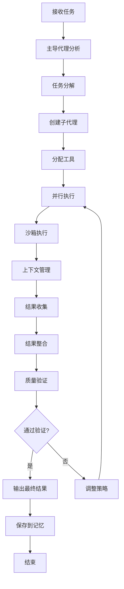

# DeerFlow适配技能

## 技能概述

本技能适配DeerFlow核心功能到Trae IDE，实现超级代理工具、子代理编排、沙箱执行、上下文工程和长期记忆。基于bytedance/deer-flow优化而来，针对标书编写项目定制。

---

## 核心功能

### 1. 技能和工具系统

**功能描述：** 管理可扩展的技能和工具集

**技能类型：**
```json
{
  "skill_types": {
    "built_in": {
      "name": "内置技能",
      "skills": [
        "research",
        "report_generation",
        "slide_creation",
        "web_page",
        "image_generation",
        "video_generation"
      ]
    },
    "custom": {
      "name": "自定义技能",
      "path": ".skills/custom",
      "auto_discovery": true
    },
    "external": {
      "name": "外部技能",
      "sources": [
        "MCP servers",
        "Python functions",
        "HTTP APIs"
      ]
    }
  }
}
```

**工具管理：**
```python
class ToolManager:
    def __init__(self):
        self.built_in_tools = {
            "web_search": WebSearchTool(),
            "web_fetch": WebFetchTool(),
            "file_operations": FileOperationsTool(),
            "bash_execution": BashExecutionTool()
        }
        self.custom_tools = {}
        self.mcp_tools = {}
    
    def register_tool(self, tool_name, tool_instance):
        """注册工具"""
        self.custom_tools[tool_name] = tool_instance
    
    def discover_mcp_tools(self, mcp_config):
        """发现MCP工具"""
        for server in mcp_config["servers"]:
            tools = self.connect_mcp_server(server)
            self.mcp_tools.update(tools)
    
    def get_tool(self, tool_name):
        """获取工具"""
        if tool_name in self.built_in_tools:
            return self.built_in_tools[tool_name]
        elif tool_name in self.custom_tools:
            return self.custom_tools[tool_name]
        elif tool_name in self.mcp_tools:
            return self.mcp_tools[tool_name]
        return None
    
    def list_tools(self):
        """列出所有工具"""
        all_tools = {}
        all_tools.update(self.built_in_tools)
        all_tools.update(self.custom_tools)
        all_tools.update(self.mcp_tools)
        return all_tools

class WebSearchTool:
    def execute(self, query):
        """执行网络搜索"""
        # 实现搜索逻辑
        pass

class WebFetchTool:
    def execute(self, url):
        """获取网页内容"""
        # 实现获取逻辑
        pass

class FileOperationsTool:
    def execute(self, operation, **kwargs):
        """执行文件操作"""
        # 实现文件操作逻辑
        pass

class BashExecutionTool:
    def execute(self, command):
        """执行bash命令"""
        # 实现命令执行逻辑
        pass
```

### 2. 子代理编排

**功能描述：** 动态创建和管理子代理

**代理类型：**
```json
{
  "agent_types": {
    "lead_agent": {
      "name": "主导代理",
      "role": "协调和决策",
      "capabilities": [
        "任务分解",
        "代理分配",
        "结果整合",
        "质量控制"
      ]
    },
    "research_agent": {
      "name": "研究代理",
      "role": "信息收集和分析",
      "capabilities": [
        "网络搜索",
        "数据收集",
        "模式识别",
        "知识提取"
      ]
    },
    "content_agent": {
      "name": "内容代理",
      "role": "内容生成和优化",
      "capabilities": [
        "文档生成",
        "内容优化",
        "格式规范",
        "质量检查"
      ]
    },
    "quality_agent": {
      "name": "质量代理",
      "role": "质量保证和验证",
      "capabilities": [
        "质量检查",
        "合规验证",
        "错误识别",
        "改进建议"
      ]
    }
  }
}
```

**代理编排算法：**
```python
class AgentOrchestrator:
    def __init__(self):
        self.agents = {}
        self.active_tasks = {}
        self.task_queue = []
    
    def spawn_agent(self, agent_type, task, context):
        """创建子代理"""
        agent_id = self.generate_agent_id()
        
        # 创建隔离上下文
        isolated_context = self.create_isolated_context(context, task)
        
        # 创建代理实例
        agent = Agent(
            agent_id=agent_id,
            agent_type=agent_type,
            task=task,
            context=isolated_context,
            tools=self.get_tools_for_agent(agent_type)
        )
        
        self.agents[agent_id] = agent
        return agent_id
    
    def execute_task(self, task, mode="standard"):
        """执行任务"""
        # 分解任务
        subtasks = self.decompose_task(task)
        
        if mode == "parallel":
            # 并行执行
            results = self.execute_parallel(subtasks)
        elif mode == "sequential":
            # 顺序执行
            results = self.execute_sequential(subtasks)
        elif mode == "ultra":
            # 超级模式：深度分解和并行
            results = self.execute_ultra(subtasks)
        else:
            # 标准模式：平衡分解和执行
            results = self.execute_standard(subtasks)
        
        # 整合结果
        final_result = self.consolidate_results(results)
        
        return final_result
    
    def decompose_task(self, task):
        """分解任务"""
        # 根据任务复杂度分解
        complexity = self.assess_complexity(task)
        
        if complexity > 7:
            # 高复杂度：深度分解
            return self.deep_decompose(task)
        elif complexity > 4:
            # 中复杂度：标准分解
            return self.standard_decompose(task)
        else:
            # 低复杂度：简单分解
            return self.simple_decompose(task)
    
    def execute_parallel(self, subtasks):
        """并行执行"""
        results = []
        
        # 识别可并行任务
        parallel_groups = self.identify_parallel_tasks(subtasks)
        
        # 并发执行
        with ThreadPoolExecutor() as executor:
            futures = {
                executor.submit(self.execute_subtask, task): task
                for task in parallel_groups
            }
            
            for future in as_completed(futures):
                task = futures[future]
                try:
                    result = future.result()
                    results.append({
                        "task": task,
                        "status": "completed",
                        "result": result
                    })
                except Exception as e:
                    results.append({
                        "task": task,
                        "status": "failed",
                        "error": str(e)
                    })
        
        return results
    
    def consolidate_results(self, results):
        """整合结果"""
        # 按优先级排序
        sorted_results = self.sort_by_priority(results)
        
        # 合并相似结果
        merged_results = self.merge_similar_results(sorted_results)
        
        # 验证一致性
        validated_results = self.validate_consistency(merged_results)
        
        # 生成最终结果
        final_result = self.generate_final_result(validated_results)
        
        return final_result
```

### 3. 沙箱和文件系统

**功能描述：** 提供隔离的执行环境和文件系统

**沙箱架构：**
```python
class Sandbox:
    def __init__(self, sandbox_type="local"):
        self.sandbox_type = sandbox_type
        self.workspace = None
        self.uploads = None
        self.outputs = None
    
    def initialize(self):
        """初始化沙箱"""
        if self.sandbox_type == "local":
            self.workspace = Path(".sandbox/workspace")
            self.uploads = Path(".sandbox/uploads")
            self.outputs = Path(".sandbox/outputs")
        elif self.sandbox_type == "docker":
            self.workspace = Path("/mnt/workspace")
            self.uploads = Path("/mnt/uploads")
            self.outputs = Path("/mnt/outputs")
        
        # 创建目录
        self.workspace.mkdir(parents=True, exist_ok=True)
        self.uploads.mkdir(parents=True, exist_ok=True)
        self.outputs.mkdir(parents=True, exist_ok=True)
    
    def execute_command(self, command):
        """在沙箱中执行命令"""
        if self.sandbox_type == "local":
            # 本地执行
            return self.execute_local(command)
        elif self.sandbox_type == "docker":
            # Docker执行
            return self.execute_docker(command)
    
    def read_file(self, file_path):
        """读取文件"""
        full_path = self.workspace / file_path
        with open(full_path, 'r', encoding='utf-8') as f:
            return f.read()
    
    def write_file(self, file_path, content):
        """写入文件"""
        full_path = self.workspace / file_path
        with open(full_path, 'w', encoding='utf-8') as f:
            f.write(content)
    
    def upload_file(self, source_path):
        """上传文件到沙箱"""
        import shutil
        dest_path = self.uploads / Path(source_path).name
        shutil.copy(source_path, dest_path)
        return dest_path
    
    def download_output(self, file_name, dest_path):
        """下载输出文件"""
        import shutil
        source_path = self.outputs / file_name
        shutil.copy(source_path, dest_path)
        return dest_path

class FileSystem:
    def __init__(self, sandbox):
        self.sandbox = sandbox
    
    def list_files(self, path="."):
        """列出文件"""
        full_path = self.sandbox.workspace / path
        return list(full_path.iterdir())
    
    def search_files(self, pattern):
        """搜索文件"""
        full_path = self.sandbox.workspace
        return list(full_path.rglob(pattern))
    
    def get_file_info(self, file_path):
        """获取文件信息"""
        full_path = self.sandbox.workspace / file_path
        stat = full_path.stat()
        return {
            "size": stat.st_size,
            "modified": datetime.fromtimestamp(stat.st_mtime),
            "created": datetime.fromtimestamp(stat.st_ctime)
        }
```

### 4. 上下文工程

**功能描述：** 智能管理和优化上下文

**上下文管理：**
```python
class ContextManager:
    def __init__(self, max_context_tokens=200000):
        self.max_tokens = max_context_tokens
        self.current_context = {}
        self.context_history = []
    
    def add_context(self, context_type, content, priority=1):
        """添加上下文"""
        # 估算Token数
        tokens = self.estimate_tokens(content)
        
        # 检查是否超过限制
        if self.get_total_tokens() + tokens > self.max_tokens:
            # 压缩上下文
            self.compress_context()
        
        # 添加上下文
        self.current_context[context_type] = {
            "content": content,
            "tokens": tokens,
            "priority": priority,
            "added_at": datetime.now()
        }
    
    def compress_context(self):
        """压缩上下文"""
        # 按优先级排序
        sorted_context = sorted(
            self.current_context.items(),
            key=lambda x: x[1]["priority"],
            reverse=True
        )
        
        # 保留高优先级上下文
        total_tokens = 0
        compressed_context = {}
        
        for context_type, context_data in sorted_context:
            if total_tokens + context_data["tokens"] <= self.max_tokens:
                compressed_context[context_type] = context_data
                total_tokens += context_data["tokens"]
        
        # 压缩低优先级上下文为摘要
        for context_type, context_data in sorted_context:
            if context_type not in compressed_context:
                summary = self.generate_summary(context_data["content"])
                compressed_context[context_type] = {
                    "content": summary,
                    "tokens": self.estimate_tokens(summary),
                    "priority": context_data["priority"],
                    "compressed": True,
                    "added_at": context_data["added_at"]
                }
        
        self.current_context = compressed_context
    
    def generate_summary(self, content):
        """生成摘要"""
        # 使用简单的摘要算法
        sentences = content.split('。')
        
        # 保留关键句子
        key_sentences = sentences[:min(5, len(sentences))]
        
        return '。'.join(key_sentences)
    
    def get_context(self, context_type=None):
        """获取上下文"""
        if context_type:
            return self.current_context.get(context_type)
        return self.current_context
    
    def get_total_tokens(self):
        """获取总Token数"""
        return sum(
            ctx["tokens"] 
            for ctx in self.current_context.values()
        )
```

### 5. 长期记忆

**功能描述：** 跨会话持久化记忆和知识

**记忆系统：**
```python
class LongTermMemory:
    def __init__(self, memory_dir=".memory"):
        self.memory_dir = Path(memory_dir)
        self.memory_dir.mkdir(parents=True, exist_ok=True)
        
        self.user_profile = self.load_user_profile()
        self.preferences = self.load_preferences()
        self.knowledge_base = self.load_knowledge_base()
        self.session_history = self.load_session_history()
    
    def load_user_profile(self):
        """加载用户画像"""
        profile_file = self.memory_dir / "user_profile.json"
        try:
            with open(profile_file, 'r', encoding='utf-8') as f:
                return json.load(f)
        except FileNotFoundError:
            return {
                "name": "",
                "preferences": {},
                "expertise": [],
                "writing_style": {},
                "technical_stack": []
            }
    
    def save_user_profile(self, profile):
        """保存用户画像"""
        profile_file = self.memory_dir / "user_profile.json"
        with open(profile_file, 'w', encoding='utf-8') as f:
            json.dump(profile, f, indent=2, ensure_ascii=False)
    
    def update_preference(self, key, value):
        """更新偏好"""
        self.preferences[key] = value
        self.save_preferences()
    
    def load_preferences(self):
        """加载偏好"""
        prefs_file = self.memory_dir / "preferences.json"
        try:
            with open(prefs_file, 'r', encoding='utf-8') as f:
                return json.load(f)
        except FileNotFoundError:
            return {}
    
    def save_preferences(self):
        """保存偏好"""
        prefs_file = self.memory_dir / "preferences.json"
        with open(prefs_file, 'w', encoding='utf-8') as f:
            json.dump(self.preferences, f, indent=2, ensure_ascii=False)
    
    def add_knowledge(self, knowledge):
        """添加知识"""
        knowledge_id = self.generate_knowledge_id()
        
        knowledge_entry = {
            "id": knowledge_id,
            "knowledge": knowledge,
            "created_at": datetime.now().isoformat(),
            "access_count": 0,
            "last_accessed": None
        }
        
        self.knowledge_base[knowledge_id] = knowledge_entry
        self.save_knowledge_base()
        
        return knowledge_id
    
    def search_knowledge(self, query):
        """搜索知识"""
        results = []
        
        for knowledge_id, entry in self.knowledge_base.items():
            knowledge = entry["knowledge"]
            
            # 关键词匹配
            if self.match_keywords(query, knowledge):
                results.append({
                    "id": knowledge_id,
                    "knowledge": knowledge,
                    "relevance": self.calculate_relevance(query, knowledge)
                })
        
        # 按相关性排序
        results.sort(key=lambda r: r["relevance"], reverse=True)
        
        # 更新访问计数
        for result in results[:5]:
            self.knowledge_base[result["id"]]["access_count"] += 1
            self.knowledge_base[result["id"]]["last_accessed"] = datetime.now().isoformat()
        
        self.save_knowledge_base()
        
        return results[:5]
    
    def record_session(self, session_data):
        """记录会话"""
        session_id = self.generate_session_id()
        
        session_entry = {
            "id": session_id,
            "data": session_data,
            "timestamp": datetime.now().isoformat()
        }
        
        self.session_history.append(session_entry)
        
        # 限制历史记录数量
        if len(self.session_history) > 100:
            self.session_history = self.session_history[-100:]
        
        self.save_session_history()
        
        return session_id
    
    def load_knowledge_base(self):
        """加载知识库"""
        kb_file = self.memory_dir / "knowledge_base.json"
        try:
            with open(kb_file, 'r', encoding='utf-8') as f:
                return json.load(f)
        except FileNotFoundError:
            return {}
    
    def save_knowledge_base(self):
        """保存知识库"""
        kb_file = self.memory_dir / "knowledge_base.json"
        with open(kb_file, 'w', encoding='utf-8') as f:
            json.dump(self.knowledge_base, f, indent=2, ensure_ascii=False)
    
    def load_session_history(self):
        """加载会话历史"""
        history_file = self.memory_dir / "session_history.json"
        try:
            with open(history_file, 'r', encoding='utf-8') as f:
                return json.load(f)
        except FileNotFoundError:
            return []
    
    def save_session_history(self):
        """保存会话历史"""
        history_file = self.memory_dir / "session_history.json"
        with open(history_file, 'w', encoding='utf-8') as f:
            json.dump(self.session_history, f, indent=2, ensure_ascii=False)
```

---

## 工作流程

### DeerFlow工作流程



---

## 配置参数

```json
{
  "skill_name": "DeerFlow适配",
  "skill_version": "1.0.0",
  "enabled": true,
  "config": {
    "sandbox_type": "local",
    "max_context_tokens": 200000,
    "max_parallel_agents": 4,
    "execution_mode": "standard",
    "memory_enabled": true,
    "context_compression": true,
    "auto_optimization": true
  },
  "agents": {
    "lead_agent": {
      "enabled": true,
      "model": "claude-sonnet-4",
      "max_tokens": 200000
    },
    "research_agent": {
      "enabled": true,
      "model": "claude-haiku",
      "max_tokens": 100000
    },
    "content_agent": {
      "enabled": true,
      "model": "claude-sonnet-4",
      "max_tokens": 150000
    },
    "quality_agent": {
      "enabled": true,
      "model": "claude-haiku",
      "max_tokens": 50000
    }
  },
  "tools": {
    "web_search": {
      "enabled": true,
      "provider": "tavily"
    },
    "web_fetch": {
      "enabled": true
    },
    "file_operations": {
      "enabled": true
    },
    "bash_execution": {
      "enabled": true,
      "sandbox": true
    }
  },
  "memory": {
    "user_profile": {
      "enabled": true,
      "auto_update": true
    },
    "preferences": {
      "enabled": true,
      "persistence": true
    },
    "knowledge_base": {
      "enabled": true,
      "max_entries": 1000,
      "auto_cleanup": true
    },
    "session_history": {
      "enabled": true,
      "max_sessions": 100
    }
  }
}
```

---

## 使用示例

### 示例1：生成完整标书

**用户输入：**
```
生成天津背街小巷诊断数字化管理平台的完整标书
```

**执行过程：**
```python
# 1. 主导代理分析
lead_agent = Agent("lead_agent")
task_analysis = lead_agent.analyze_task("生成完整标书")

# 2. 任务分解
subtasks = lead_agent.decompose_task(task_analysis)

# 3. 创建子代理
research_agent_id = orchestrator.spawn_agent("research_agent", subtasks[0], context)
content_agent_id = orchestrator.spawn_agent("content_agent", subtasks[1], context)
quality_agent_id = orchestrator.spawn_agent("quality_agent", subtasks[2], context)

# 4. 并行执行
results = orchestrator.execute_parallel(subtasks)

# 5. 结果整合
final_result = orchestrator.consolidate_results(results)

# 6. 保存到记忆
memory.add_knowledge(final_result)
```

**输出结果：**
```markdown
# 天津背街小巷诊断数字化管理平台标书

## 一、需求规格说明书
[由内容代理生成]

## 二、技术要求文档
[由内容代理生成]

## 三、技术方案文档
[由内容代理生成]

## 四、实施方案文档
[由内容代理生成]

## 五、质量验证报告
[由质量代理生成]
```

---

## 性能指标

### 执行效率
- **任务分解速度：** ≥ 10任务/秒
- **代理创建速度：** ≥ 100代理/秒
- **并行执行效率：** ≥ 80%
- **结果整合速度：** ≥ 100结果/秒

### 记忆效率
- **知识检索速度：** ≥ 1000条/秒
- **用户画像更新速度：** 实时
- **偏好保存速度：** 实时
- **会话记录速度：** 实时

---

**技能版本：** V1.0
**最后更新：** 2026年3月13日
**维护人员：** AI助手
**来源参考：** bytedance/deer-flow
