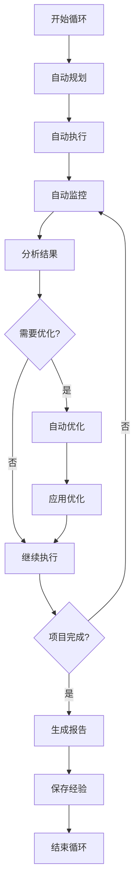

# 项目管理自动化技能

## 技能概述

本技能实现自主项目管理循环，自动化项目规划、执行、监控和优化。基于everything-claude-code的autonomous-loops技能优化而来，针对标书编写项目定制。

---

## 核心功能

### 1. 自动规划

**功能描述：** 自动生成项目计划和里程碑

**规划类型：**
```markdown
# 自动规划类型

## 项目规划
- 项目目标定义
- 项目范围确定
- 项目时间规划
- 资源需求分析
- 风险评估

## 任务规划
- 任务分解
- 任务依赖关系
- 任务优先级排序
- 任务分配

## 质量规划
- 质量目标设定
- 质量标准制定
- 质量检查计划
- 质量改进计划

## 风险规划
- 风险识别
- 风险评估
- 风险应对策略
- 风险监控计划
```

**规划算法：**
```python
def auto_plan(project_requirements):
    """
    自动规划
    
    Args:
        project_requirements: 项目需求
        
    Returns:
        项目计划
    """
    plan = {
        "project_plan": generate_project_plan(project_requirements),
        "task_plan": generate_task_plan(project_requirements),
        "quality_plan": generate_quality_plan(project_requirements),
        "risk_plan": generate_risk_plan(project_requirements)
    }
    
    # 优化计划
    optimized_plan = optimize_plan(plan)
    
    return optimized_plan

def generate_project_plan(requirements):
    """生成项目计划"""
    # 分析项目需求
    project_type = analyze_project_type(requirements)
    complexity = analyze_complexity(requirements)
    scale = analyze_scale(requirements)
    
    # 估算时间
    estimated_duration = estimate_duration(project_type, complexity, scale)
    
    # 确定里程碑
    milestones = generate_milestones(estimated_duration, project_type)
    
    # 分析资源需求
    resource_requirements = analyze_resource_requirements(requirements)
    
    return {
        "project_type": project_type,
        "complexity": complexity,
        "scale": scale,
        "estimated_duration": estimated_duration,
        "milestones": milestones,
        "resource_requirements": resource_requirements
    }

def generate_task_plan(requirements):
    """生成任务计划"""
    # 分解任务
    tasks = decompose_tasks(requirements)
    
    # 分析依赖关系
    dependencies = analyze_dependencies(tasks)
    
    # 排序任务
    sorted_tasks = topological_sort(tasks, dependencies)
    
    # 分配优先级
    prioritized_tasks = assign_priorities(sorted_tasks)
    
    # 估算时间
    time_estimates = estimate_task_times(prioritized_tasks)
    
    return {
        "tasks": prioritized_tasks,
        "dependencies": dependencies,
        "time_estimates": time_estimates
    }

def generate_quality_plan(requirements):
    """生成质量计划"""
    # 确定质量目标
    quality_goals = determine_quality_goals(requirements)
    
    # 制定质量标准
    quality_standards = define_quality_standards(quality_goals)
    
    # 规划质量检查
    quality_checks = plan_quality_checks(quality_standards)
    
    # 制定改进计划
    improvement_plan = create_improvement_plan(quality_goals)
    
    return {
        "quality_goals": quality_goals,
        "quality_standards": quality_standards,
        "quality_checks": quality_checks,
        "improvement_plan": improvement_plan
    }

def generate_risk_plan(requirements):
    """生成风险计划"""
    # 识别风险
    risks = identify_risks(requirements)
    
    # 评估风险
    assessed_risks = assess_risks(risks)
    
    # 制定应对策略
    mitigation_strategies = develop_mitigation_strategies(assessed_risks)
    
    # 规划监控
    monitoring_plan = create_monitoring_plan(assessed_risks)
    
    return {
        "risks": assessed_risks,
        "mitigation_strategies": mitigation_strategies,
        "monitoring_plan": monitoring_plan
    }
```

### 2. 自动执行

**功能描述：** 自动执行项目任务

**执行模式：**
```markdown
# 自动执行模式

## 顺序执行
- 按依赖顺序执行
- 等待前置任务完成
- 处理执行错误
- 记录执行结果

## 并行执行
- 识别可并行任务
- 并发执行独立任务
- 协调资源使用
- 合并执行结果

## 条件执行
- 基于条件判断
- 动态调整执行策略
- 处理分支逻辑
- 支持循环执行

## 错误恢复
- 自动重试失败任务
- 回滚错误操作
- 记录错误信息
- 生成错误报告
```

**执行算法：**
```python
def auto_execute(plan, execution_mode="parallel"):
    """
    自动执行
    
    Args:
        plan: 执行计划
        execution_mode: 执行模式
        
    Returns:
        执行结果
    """
    results = {
        "tasks": [],
        "errors": [],
        "warnings": []
    }
    
    if execution_mode == "sequential":
        results = execute_sequential(plan, results)
    elif execution_mode == "parallel":
        results = execute_parallel(plan, results)
    elif execution_mode == "conditional":
        results = execute_conditional(plan, results)
    
    # 处理错误
    results = handle_errors(results)
    
    return results

def execute_sequential(plan, results):
    """顺序执行"""
    tasks = plan["tasks"]
    
    for task in tasks:
        # 检查依赖
        if not check_dependencies(task, results["tasks"]):
            continue
        
        # 执行任务
        try:
            task_result = execute_task(task)
            results["tasks"].append({
                "task": task,
                "status": "completed",
                "result": task_result
            })
        except Exception as e:
            results["errors"].append({
                "task": task,
                "error": str(e),
                "timestamp": datetime.now().isoformat()
            })
            
            # 尝试恢复
            if can_recover(task, e):
                recovery_result = recover_task(task, e)
                results["tasks"].append({
                    "task": task,
                    "status": "recovered",
                    "result": recovery_result
                })
    
    return results

def execute_parallel(plan, results):
    """并行执行"""
    tasks = plan["tasks"]
    
    # 识别可并行任务
    parallel_groups = identify_parallel_tasks(tasks)
    
    for group in parallel_groups:
        # 并发执行
        with ThreadPoolExecutor() as executor:
            futures = {
                executor.submit(execute_task, task): task
                for task in group
            }
            
            for future in as_completed(futures):
                task = futures[future]
                try:
                    task_result = future.result()
                    results["tasks"].append({
                        "task": task,
                        "status": "completed",
                        "result": task_result
                    })
                except Exception as e:
                    results["errors"].append({
                        "task": task,
                        "error": str(e),
                        "timestamp": datetime.now().isoformat()
                    })
    
    return results
```

### 3. 自动监控

**功能描述：** 自动监控项目进度和质量

**监控指标：**
```json
{
  "monitoring_metrics": {
    "progress": {
      "tasks_completed": "已完成任务数",
      "tasks_total": "总任务数",
      "completion_rate": "完成率",
      "time_spent": "已用时间",
      "time_remaining": "剩余时间"
    },
    "quality": {
      "quality_score": "质量得分",
      "defect_count": "缺陷数量",
      "defect_rate": "缺陷率",
      "compliance_rate": "合规率"
    },
    "performance": {
      "task_throughput": "任务吞吐量",
      "average_duration": "平均持续时间",
      "on_time_rate": "按时完成率",
      "resource_utilization": "资源利用率"
    },
    "risks": {
      "risk_count": "风险数量",
      "active_risks": "活跃风险",
      "mitigated_risks": "已缓解风险",
      "risk_level": "风险等级"
    }
  }
}
```

**监控算法：**
```python
def auto_monitor(project):
    """
    自动监控
    
    Args:
        project: 项目对象
        
    Returns:
        监控报告
    """
    report = {
        "timestamp": datetime.now().isoformat(),
        "progress": monitor_progress(project),
        "quality": monitor_quality(project),
        "performance": monitor_performance(project),
        "risks": monitor_risks(project)
    }
    
    # 分析趋势
    trends = analyze_trends(report)
    report["trends"] = trends
    
    # 生成告警
    alerts = generate_alerts(report)
    report["alerts"] = alerts
    
    return report

def monitor_progress(project):
    """监控进度"""
    tasks = project.tasks
    completed = [t for t in tasks if t.status == "completed"]
    
    return {
        "tasks_completed": len(completed),
        "tasks_total": len(tasks),
        "completion_rate": len(completed) / len(tasks),
        "time_spent": calculate_time_spent(completed),
        "time_remaining": estimate_time_remaining(tasks)
    }

def monitor_quality(project):
    """监控质量"""
    quality_checks = project.quality_checks
    defects = project.defects
    
    return {
        "quality_score": calculate_quality_score(quality_checks),
        "defect_count": len(defects),
        "defect_rate": len(defects) / len(project.tasks),
        "compliance_rate": calculate_compliance_rate(quality_checks)
    }

def monitor_performance(project):
    """监控性能"""
    tasks = project.tasks
    
    return {
        "task_throughput": calculate_throughput(tasks),
        "average_duration": calculate_average_duration(tasks),
        "on_time_rate": calculate_on_time_rate(tasks),
        "resource_utilization": calculate_resource_utilization(project)
    }

def monitor_risks(project):
    """监控风险"""
    risks = project.risks
    
    active_risks = [r for r in risks if r.status == "active"]
    mitigated_risks = [r for r in risks if r.status == "mitigated"]
    
    return {
        "risk_count": len(risks),
        "active_risks": len(active_risks),
        "mitigated_risks": len(mitigated_risks),
        "risk_level": calculate_risk_level(active_risks)
    }
```

### 4. 自动优化

**功能描述：** 基于监控结果自动优化项目

**优化策略：**
```markdown
# 自动优化策略

## 进度优化
- 调整任务优先级
- 重新分配资源
- 优化任务顺序
- 压缩关键路径

## 质量优化
- 识别质量问题
- 优化质量标准
- 改进检查流程
- 加强质量控制

## 性能优化
- 识别性能瓶颈
- 优化执行流程
- 提高资源利用率
- 减少等待时间

## 风险优化
- 识别新风险
- 更新风险应对
- 加强风险监控
- 优化风险缓解
```

**优化算法：**
```python
def auto_optimize(project, monitoring_report):
    """
    自动优化
    
    Args:
        project: 项目对象
        monitoring_report: 监控报告
        
    Returns:
        优化建议
    """
    optimizations = {
        "progress": optimize_progress(project, monitoring_report),
        "quality": optimize_quality(project, monitoring_report),
        "performance": optimize_performance(project, monitoring_report),
        "risks": optimize_risks(project, monitoring_report)
    }
    
    # 评估优化效果
    estimated_impact = estimate_optimization_impact(optimizations)
    
    # 生成优化计划
    optimization_plan = generate_optimization_plan(optimizations, estimated_impact)
    
    return optimization_plan

def optimize_progress(project, report):
    """优化进度"""
    optimizations = []
    
    # 分析进度趋势
    if report["trends"]["progress"]["trend"] == "slowing":
        # 进度放缓
        optimizations.append({
            "type": "progress",
            "action": "reallocate_resources",
            "description": "重新分配资源以加快进度",
            "priority": "high"
        })
    
    # 分析完成率
    if report["progress"]["completion_rate"] < 0.5:
        # 完成率低
        optimizations.append({
            "type": "progress",
            "action": "reprioritize_tasks",
            "description": "重新排序任务优先级",
            "priority": "high"
        })
    
    return optimizations

def optimize_quality(project, report):
    """优化质量"""
    optimizations = []
    
    # 分析质量得分
    if report["quality"]["quality_score"] < 0.8:
        # 质量得分低
        optimizations.append({
            "type": "quality",
            "action": "strengthen_quality_control",
            "description": "加强质量控制",
            "priority": "high"
        })
    
    # 分析缺陷率
    if report["quality"]["defect_rate"] > 0.1:
        # 缺陷率高
        optimizations.append({
            "type": "quality",
            "action": "improve_testing",
            "description": "改进测试流程",
            "priority": "medium"
        })
    
    return optimizations

def optimize_performance(project, report):
    """优化性能"""
    optimizations = []
    
    # 分析资源利用率
    if report["performance"]["resource_utilization"] < 0.7:
        # 资源利用率低
        optimizations.append({
            "type": "performance",
            "action": "optimize_resource_allocation",
            "description": "优化资源分配",
            "priority": "medium"
        })
    
    # 分析按时完成率
    if report["performance"]["on_time_rate"] < 0.8:
        # 按时完成率低
        optimizations.append({
            "type": "performance",
            "action": "improve_time_estimation",
            "description": "改进时间估算",
            "priority": "medium"
        })
    
    return optimizations

def optimize_risks(project, report):
    """优化风险"""
    optimizations = []
    
    # 分析风险等级
    if report["risks"]["risk_level"] == "high":
        # 风险等级高
        optimizations.append({
            "type": "risk",
            "action": "strengthen_risk_mitigation",
            "description": "加强风险缓解",
            "priority": "high"
        })
    
    # 分析活跃风险
    if report["risks"]["active_risks"] > 3:
        # 活跃风险多
        optimizations.append({
            "type": "risk",
            "action": "increase_monitoring",
            "description": "增加风险监控频率",
            "priority": "medium"
        })
    
    return optimizations
```

---

## 工作流程

### 自主循环流程



---

## 配置参数

```json
{
  "skill_name": "项目管理自动化",
  "skill_version": "1.0.0",
  "enabled": true,
  "config": {
    "auto_plan": true,
    "auto_execute": true,
    "auto_monitor": true,
    "auto_optimize": true,
    "execution_mode": "parallel",
    "monitoring_interval": 300,
    "optimization_threshold": 0.8
  },
  "planning": {
    "complexity_analysis": true,
    "resource_analysis": true,
    "risk_assessment": true,
    "milestone_generation": true
  },
  "execution": {
    "parallel_execution": true,
    "max_parallel_tasks": 4,
    "retry_on_failure": true,
    "max_retries": 3,
    "error_recovery": true
  },
  "monitoring": {
    "progress_monitoring": true,
    "quality_monitoring": true,
    "performance_monitoring": true,
    "risk_monitoring": true,
    "alert_threshold": 0.7
  },
  "optimization": {
    "auto_optimize": true,
    "optimization_interval": 600,
    "min_impact_threshold": 0.1,
    "apply_automatically": false
  }
}
```

---

## 使用示例

### 示例1：自动化标书编写项目

**用户输入：**
```
自动化管理天津背街小巷诊断数字化管理平台标书编写项目
```

**执行过程：**
```python
# 1. 自动规划
plan = auto_plan({
    "project_name": "天津背街小巷诊断数字化管理平台",
    "project_type": "标书编写",
    "requirements": [
        "需求规格说明书",
        "技术要求文档",
        "技术方案文档",
        "实施方案文档"
    ]
})

# 2. 自动执行
results = auto_execute(plan, execution_mode="parallel")

# 3. 自动监控
report = auto_monitor(project)

# 4. 自动优化
optimizations = auto_optimize(project, report)
```

**输出结果：**
```markdown
# 项目管理报告

## 项目概况
- 项目名称：天津背街小巷诊断数字化管理平台
- 项目类型：标书编写
- 开始时间：2026-03-13 09:00:00
- 当前时间：2026-03-13 16:00:00

## 进度监控
- 已完成任务：8/12
- 完成率：66.7%
- 已用时间：7小时
- 剩余时间：3.5小时

## 质量监控
- 质量得分：0.87
- 缺陷数量：2
- 缺陷率：16.7%
- 合规率：95%

## 性能监控
- 任务吞吐量：1.14任务/小时
- 平均持续时间：0.88小时/任务
- 按时完成率：75%
- 资源利用率：85%

## 风险监控
- 风险数量：3
- 活跃风险：1
- 已缓解风险：2
- 风险等级：中

## 优化建议
[具体优化建议]
```

---

## 性能指标

### 自动化效率
- **规划速度：** ≥ 100任务/分钟
- **执行速度：** ≥ 10任务/分钟
- **监控速度：** 实时
- **优化速度：** ≥ 50建议/分钟

### 管理效果
- **进度准确性：** ≥ 90%
- **质量提升：** ≥ 30%
- **效率提升：** ≥ 40%
- **风险降低：** ≥ 50%

---

**技能版本：** V1.0
**最后更新：** 2026年3月13日
**维护人员：** AI助手
**来源参考：** everything-claude-code/autonomous-loops
