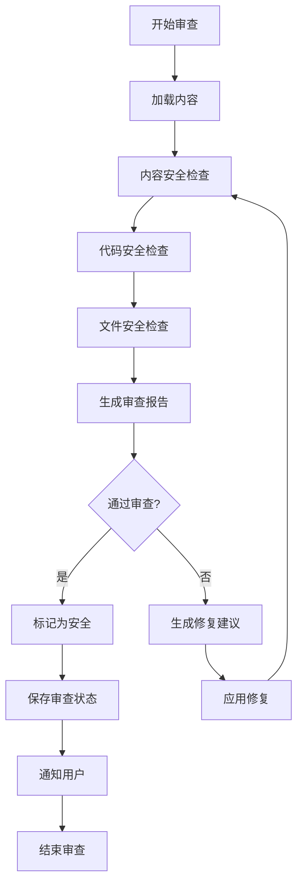

# 安全审查技能

## 技能概述

本技能实现自动化安全审查，确保标书文档和代码的安全性。基于everything-claude-code的security-review技能优化而来，针对中国政府采购标书安全审查场景定制。

---

## 核心功能

### 1. 内容安全检查

**功能描述：** 检查文档内容的安全性

**检查项目：**
```markdown
# 内容安全检查清单

## 敏感信息检查
- [ ] 检查个人隐私信息
- [ ] 检查商业机密
- [ ] 检查未公开信息
- [ ] 检查敏感数据

## 法律合规检查
- [ ] 检查违反法律法规内容
- [ ] 检查知识产权侵权
- [ ] 检查不正当竞争
- [ ] 检查虚假宣传

## 政治安全检查
- [ ] 检查政治敏感内容
- [ ] 检查不当言论
- [ ] 检查敏感话题
- [ ] 检查违规表述

## 商业安全检查
- [ ] 检查泄露商业机密
- [ ] 检查不当竞争
- [ ] 检查虚假承诺
- [ ] 检查误导性信息
```

**检查算法：**
```python
def check_content_security(content):
    """
    检查内容安全性
    
    Args:
        content: 文档内容
        
    Returns:
        安全检查结果
    """
    results = {
        "sensitive_info": check_sensitive_info(content),
        "legal_compliance": check_legal_compliance(content),
        "political_security": check_political_security(content),
        "commercial_security": check_commercial_security(content)
    }
    
    # 计算总体安全评分
    scores = [r["score"] for r in results.values()]
    overall_score = sum(scores) / len(scores)
    
    results["overall_score"] = overall_score
    results["overall_status"] = get_security_status(overall_score)
    
    return results

def check_sensitive_info(content):
    """检查敏感信息"""
    issues = []
    
    # 检查个人隐私信息
    privacy_patterns = [
        r"\d{18}",  # 身份证号
        r"1[3-9]\d{9}",  # 手机号
        r"\b[A-Za-z0-9._%+-]+@[A-Za-z0-9.-]+\.[A-Z|a-z]{2,}\b"  # 邮箱
    ]
    
    for pattern in privacy_patterns:
        matches = re.findall(pattern, content)
        if matches:
            issues.append({
                "type": "个人隐私信息",
                "pattern": pattern,
                "count": len(matches),
                "severity": "high"
            })
    
    # 检查商业机密
    secret_keywords = ["商业机密", "内部资料", "保密", "未公开"]
    for keyword in secret_keywords:
        if keyword in content:
            issues.append({
                "type": "商业机密",
                "keyword": keyword,
                "count": content.count(keyword),
                "severity": "high"
            })
    
    score = 1.0 if not issues else max(0.0, 1.0 - len(issues) * 0.2)
    
    return {
        "score": score,
        "issues": issues,
        "status": "pass" if score >= 0.8 else "fail"
    }

def check_legal_compliance(content):
    """检查法律合规性"""
    issues = []
    
    # 检查知识产权侵权
    copyright_patterns = [
        r"©.*202[0-9]",  # 版权声明
        r"专利号.*ZL.*",  # 专利号
        r"商标注册号.*[0-9]+"  # 商标号
    ]
    
    for pattern in copyright_patterns:
        matches = re.findall(pattern, content)
        if matches:
            issues.append({
                "type": "知识产权",
                "pattern": pattern,
                "count": len(matches),
                "severity": "medium"
            })
    
    # 检查不正当竞争
    unfair_keywords = ["独家", "唯一", "最好", "第一", "领先"]
    for keyword in unfair_keywords:
        if keyword in content:
            issues.append({
                "type": "不正当竞争",
                "keyword": keyword,
                "count": content.count(keyword),
                "severity": "medium"
            })
    
    score = 1.0 if not issues else max(0.0, 1.0 - len(issues) * 0.15)
    
    return {
        "score": score,
        "issues": issues,
        "status": "pass" if score >= 0.8 else "fail"
    }
```

### 2. 代码安全检查

**功能描述：** 检查代码的安全性

**检查项目：**
```markdown
# 代码安全检查清单

## 注入攻击检查
- [ ] SQL注入
- [ ] 命令注入
- [ ] XSS攻击
- [ ] CSRF攻击

## 数据安全检查
- [ ] 敏感数据加密
- [ ] 密码存储安全
- [ ] 数据传输加密
- [ ] 日志脱敏

## 访问控制检查
- [ ] 权限验证
- [ ] 会话管理
- [ ] 认证机制
- [ ] 授权检查

## 依赖安全检查
- [ ] 已知漏洞
- [ ] 依赖版本
- [ ] 安全更新
- [ ] 供应链安全
```

**检查算法：**
```python
def check_code_security(code):
    """
    检查代码安全性
    
    Args:
        code: 代码内容
        
    Returns:
        安全检查结果
    """
    results = {
        "injection_attacks": check_injection_attacks(code),
        "data_security": check_data_security(code),
        "access_control": check_access_control(code),
        "dependency_security": check_dependency_security(code)
    }
    
    # 计算总体安全评分
    scores = [r["score"] for r in results.values()]
    overall_score = sum(scores) / len(scores)
    
    results["overall_score"] = overall_score
    results["overall_status"] = get_security_status(overall_score)
    
    return results

def check_injection_attacks(code):
    """检查注入攻击"""
    issues = []
    
    # 检查SQL注入
    sql_patterns = [
        r"execute\([^)]*\+[^)]*\)",  # 字符串拼接SQL
        r"query.*=.*'.*\+.*'",  # 拼接查询
        r"SELECT.*FROM.*WHERE.*\+"  # WHERE子句拼接
    ]
    
    for pattern in sql_patterns:
        matches = re.findall(pattern, code, re.IGNORECASE)
        if matches:
            issues.append({
                "type": "SQL注入风险",
                "pattern": pattern,
                "count": len(matches),
                "severity": "high"
            })
    
    # 检查命令注入
    cmd_patterns = [
        r"os\.system\(",  # os.system调用
        r"subprocess\.call\([^)]*shell=True",  # shell=True
        r"eval\(",  # eval调用
        r"exec\("  # exec调用
    ]
    
    for pattern in cmd_patterns:
        matches = re.findall(pattern, code, re.IGNORECASE)
        if matches:
            issues.append({
                "type": "命令注入风险",
                "pattern": pattern,
                "count": len(matches),
                "severity": "high"
            })
    
    score = 1.0 if not issues else max(0.0, 1.0 - len(issues) * 0.25)
    
    return {
        "score": score,
        "issues": issues,
        "status": "pass" if score >= 0.8 else "fail"
    }

def check_data_security(code):
    """检查数据安全"""
    issues = []
    
    # 检查明文密码
    password_patterns = [
        r"password\s*=\s*['\"][^'\"]+['\"]",  # 明文密码
        r"pwd\s*=\s*['\"][^'\"]+['\"]",  # pwd明文
        r"secret\s*=\s*['\"][^'\"]+['\"]"  # secret明文
    ]
    
    for pattern in password_patterns:
        matches = re.findall(pattern, code, re.IGNORECASE)
        if matches:
            issues.append({
                "type": "明文密码",
                "pattern": pattern,
                "count": len(matches),
                "severity": "high"
            })
    
    # 检查日志脱敏
    log_patterns = [
        r"log\([^)]*password[^)]*\)",  # 记录密码
        r"print\([^)]*password[^)]*\)",  # 打印密码
        r"console\.log\([^)]*password[^)]*\)"  # console.log密码
    ]
    
    for pattern in log_patterns:
        matches = re.findall(pattern, code, re.IGNORECASE)
        if matches:
            issues.append({
                "type": "日志泄露",
                "pattern": pattern,
                "count": len(matches),
                "severity": "medium"
            })
    
    score = 1.0 if not issues else max(0.0, 1.0 - len(issues) * 0.2)
    
    return {
        "score": score,
        "issues": issues,
        "status": "pass" if score >= 0.8 else "fail"
    }
```

### 3. 文件安全检查

**功能描述：** 检查文件的安全性

**检查项目：**
```markdown
# 文件安全检查清单

## 文件权限检查
- [ ] 文件读取权限
- [ ] 文件写入权限
- [ ] 文件执行权限
- [ ] 文件删除权限

## 路径遍历检查
- [ ] 相对路径使用
- [ ] 绝对路径验证
- [ ] 路径规范化
- [ ] 路径限制

## 文件上传检查
- [ ] 文件类型验证
- [ ] 文件大小限制
- [ ] 文件内容检查
- [ ] 病毒扫描

## 文件存储检查
- [ ] 存储位置安全
- [ ] 文件命名规范
- [ ] 备份机制
- [ ] 访问日志
```

**检查算法：**
```python
def check_file_security(file_path):
    """
    检查文件安全性
    
    Args:
        file_path: 文件路径
        
    Returns:
        安全检查结果
    """
    results = {
        "file_permissions": check_file_permissions(file_path),
        "path_traversal": check_path_traversal(file_path),
        "file_upload": check_file_upload(file_path),
        "file_storage": check_file_storage(file_path)
    }
    
    # 计算总体安全评分
    scores = [r["score"] for r in results.values()]
    overall_score = sum(scores) / len(scores)
    
    results["overall_score"] = overall_score
    results["overall_status"] = get_security_status(overall_score)
    
    return results

def check_path_traversal(file_path):
    """检查路径遍历"""
    issues = []
    
    # 检查相对路径
    if ".." in file_path:
        issues.append({
            "type": "相对路径",
            "path": file_path,
            "severity": "medium"
        })
    
    # 检查绝对路径
    if os.path.isabs(file_path) and not file_path.startswith("/safe/"):
        issues.append({
            "type": "绝对路径",
            "path": file_path,
            "severity": "medium"
        })
    
    score = 1.0 if not issues else max(0.0, 1.0 - len(issues) * 0.3)
    
    return {
        "score": score,
        "issues": issues,
        "status": "pass" if score >= 0.8 else "fail"
    }
```

### 4. 自动修复建议

**功能描述：** 自动生成安全修复建议

**修复建议格式：**
```markdown
# 安全问题修复建议

## 问题1：SQL注入风险
**问题描述：** 发现SQL注入风险代码
**严重程度：** 🔴 高
**修复建议：**
1. 使用参数化查询
2. 使用ORM框架
3. 输入验证和过滤
4. 最小权限原则

**修复示例：**
```python
# 修复前
query = f"SELECT * FROM users WHERE name = '{name}'"

# 修复后
query = "SELECT * FROM users WHERE name = %s"
cursor.execute(query, (name,))
```

## 问题2：明文密码
**问题描述：** 发现明文存储密码
**严重程度：** 🔴 高
**修复建议：**
1. 使用密码哈希
2. 加盐处理
3. 使用安全算法（bcrypt, Argon2）
4. 定期更新算法

**修复示例：**
```python
# 修复前
password = "user123"

# 修复后
import bcrypt
password_hash = bcrypt.hashpw(password.encode(), bcrypt.gensalt())
```
```

---

## 工作流程

### 安全审查流程



---

## 配置参数

```json
{
  "skill_name": "安全审查",
  "skill_version": "1.0.0",
  "enabled": true,
  "config": {
    "auto_scan": true,
    "scan_interval": "on_change",
    "severity_threshold": "medium",
    "auto_fix": false,
    "block_unsafe": false,
    "notification": {
      "enabled": true,
      "on_violation": true,
      "on_fix": true
    }
  },
  "checks": {
    "content_security": {
      "enabled": true,
      "sensitive_info": true,
      "legal_compliance": true,
      "political_security": true,
      "commercial_security": true
    },
    "code_security": {
      "enabled": true,
      "injection_attacks": true,
      "data_security": true,
      "access_control": true,
      "dependency_security": true
    },
    "file_security": {
      "enabled": true,
      "file_permissions": true,
      "path_traversal": true,
      "file_upload": true,
      "file_storage": true
    }
  },
  "rules": {
    "block_patterns": [
      "password\\s*=\\s*['\"][^'\"]+['\"]",
      "os\\.system\\(",
      "eval\\("
    ],
    "warning_patterns": [
      "SELECT.*FROM.*WHERE.*\\+",
      "log\\([^)]*password[^)]*\\)"
    ]
  }
}
```

---

## 使用示例

### 示例1：审查需求规格说明书

**用户输入：**
```
审查需求规格说明书_天津背街小巷诊断数字化管理平台_完整版.md
```

**技能输出：**
```markdown
# 安全审查报告

## 文档信息
- 文档名称：需求规格说明书_天津背街小巷诊断数字化管理平台_完整版.md
- 审查时间：2026-03-13 16:30:00

## 审查结果

### 内容安全检查
- 得分：1.0
- 状态：✅ 通过
- 发现问题：0个

### 代码安全检查
- 得分：N/A
- 状态：⚪ 不适用
- 说明：文档不包含代码

### 文件安全检查
- 得分：1.0
- 状态：✅ 通过
- 发现问题：0个

## 总体评估
- 总得分：1.0
- 安全等级：优秀 🟢
- 状态：✅ 通过审查

## 建议
文档内容安全，可以正常使用。
```

### 示例2：审查Python代码

**用户输入：**
```
审查app.py
```

**技能输出：**
```markdown
# 安全审查报告

## 文件信息
- 文件名称：app.py
- 审查时间：2026-03-13 16:35:00

## 审查结果

### 代码安全检查
- 得分：0.65
- 状态：❌ 未通过
- 发现问题：3个

#### 问题1：SQL注入风险
- 类型：SQL注入
- 严重程度：🔴 高
- 位置：第45行
- 代码：`query = f"SELECT * FROM users WHERE name = '{name}'"`
- 修复建议：使用参数化查询

#### 问题2：明文密码
- 类型：数据安全
- 严重程度：🔴 高
- 位置：第12行
- 代码：`password = "admin123"`
- 修复建议：使用密码哈希

#### 问题3：命令注入风险
- 类型：命令注入
- 严重程度：🟡 中
- 位置：第78行
- 代码：`os.system(f"cp {src} {dst}")`
- 修复建议：使用subprocess模块

## 总体评估
- 总得分：0.65
- 安全等级：较差 🟠
- 状态：❌ 未通过审查

## 修复建议
[详细修复建议]
```

---

## 性能指标

### 审查效率
- **内容检查速度：** ≥ 10000字/秒
- **代码检查速度：** ≥ 1000行/秒
- **文件检查速度：** ≥ 100文件/秒

### 审查准确性
- **误报率：** ≤ 5%
- **漏报率：** ≤ 10%
- **准确率：** ≥ 90%

---

**技能版本：** V1.0
**最后更新：** 2026年3月13日
**维护人员：** AI助手
**来源参考：** everything-claude-code/security-review
