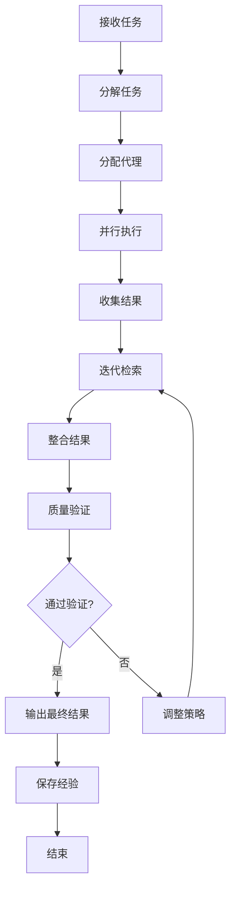

# 子代理编排技能

## 技能概述

本技能实现智能子代理编排，通过迭代检索和多代理协作完成复杂任务。基于everything-claude-code的iterative-retrieval技能优化而来，针对标书编写项目定制。

---

## 核心功能

### 1. 任务分解

**功能描述：** 将复杂任务分解为可管理的子任务

**分解策略：**
```markdown
# 任务分解策略

## 按阶段分解
- 需求分析阶段
- 内容规划阶段
- 内容生成阶段
- 质量检查阶段
- 优化完善阶段

## 按模块分解
- 文档模块
- 代码模块
- 测试模块
- 部署模块
- 维护模块

## 按优先级分解
- 高优先级任务
- 中优先级任务
- 低优先级任务
- 依赖任务
- 独立任务

## 按依赖关系分解
- 前置任务
- 并行任务
- 后续任务
- 关键路径任务
- 非关键路径任务
```

**分解算法：**
```python
def decompose_task(task, max_depth=3):
    """
    分解任务
    
    Args:
        task: 主任务
        max_depth: 最大分解深度
        
    Returns:
        任务树
    """
    task_tree = {
        "task": task,
        "subtasks": [],
        "depth": 0
    }
    
    # 递归分解
    def _decompose(node, current_depth):
        if current_depth >= max_depth:
            return
        
        # 识别子任务
        subtasks = identify_subtasks(node["task"])
        
        for subtask in subtasks:
            child = {
                "task": subtask,
                "subtasks": [],
                "depth": current_depth + 1,
                "parent": node
            }
            node["subtasks"].append(child)
            
            # 递归分解
            _decompose(child, current_depth + 1)
    
    _decompose(task_tree, 0)
    return task_tree

def identify_subtasks(task):
    """识别子任务"""
    subtasks = []
    
    # 根据任务类型识别子任务
    if "需求规格说明书" in task:
        subtasks = [
            "分析项目背景",
            "定义建设目标",
            "设计技术架构",
            "编写功能需求",
            "编写性能需求",
            "编写安全需求",
            "编写验收标准"
        ]
    elif "技术要求" in task:
        subtasks = [
            "分析技术需求",
            "设计技术方案",
            "制定技术标准",
            "编写技术规范",
            "验证技术可行性"
        ]
    elif "实施方案" in task:
        subtasks = [
            "制定实施计划",
            "设计实施步骤",
            "规划资源配置",
            "制定进度安排",
            "设计质量保障"
        ]
    
    return subtasks
```

### 2. 代理分配

**功能描述：** 根据任务特点分配给合适的代理

**代理类型：**
```json
{
  "agent_types": {
    "content_engineering": {
      "name": "内容工程代理",
      "capabilities": [
        "文档生成",
        "内容优化",
        "语调控制",
        "格式规范"
      ],
      "skills": [
        "content-engineering",
        "bidding-automation"
      ]
    },
    "quality_assurance": {
      "name": "质量保证代理",
      "capabilities": [
        "质量检查",
        "合规验证",
        "错误识别",
        "改进建议"
      ],
      "skills": [
        "verification-loop",
        "security-review"
      ]
    },
    "research_agent": {
      "name": "研究代理",
      "capabilities": [
        "信息检索",
        "数据分析",
        "模式识别",
        "知识提取"
      ],
      "skills": [
        "continuous-learning",
        "token-optimization"
      ]
    },
    "automation_agent": {
      "name": "自动化代理",
      "capabilities": [
        "流程自动化",
        "任务调度",
        "批量处理",
        "监控告警"
      ],
      "skills": [
        "folder-automation",
        "bidding-automation"
      ]
    }
  }
}
```

**分配算法：**
```python
def assign_agent(task):
    """
    分配代理
    
    Args:
        task: 任务描述
        
    Returns:
        分配的代理
    """
    # 分析任务特征
    task_features = analyze_task_features(task)
    
    # 评分每个代理
    agent_scores = {}
    for agent_type, agent_info in agent_types.items():
        score = calculate_agent_score(task_features, agent_info)
        agent_scores[agent_type] = score
    
    # 选择得分最高的代理
    best_agent = max(agent_scores, key=agent_scores.get)
    
    return {
        "agent_type": best_agent,
        "agent_info": agent_types[best_agent],
        "score": agent_scores[best_agent],
        "confidence": calculate_confidence(agent_scores)
    }

def analyze_task_features(task):
    """分析任务特征"""
    features = {
        "content_generation": False,
        "quality_check": False,
        "research": False,
        "automation": False
    }
    
    # 关键词匹配
    if any(kw in task for kw in ["生成", "编写", "创建", "撰写"]):
        features["content_generation"] = True
    
    if any(kw in task for kw in ["检查", "验证", "审查", "测试"]):
        features["quality_check"] = True
    
    if any(kw in task for kw in ["研究", "分析", "调研", "学习"]):
        features["research"] = True
    
    if any(kw in task for kw in ["自动化", "批量", "调度", "监控"]):
        features["automation"] = True
    
    return features

def calculate_agent_score(task_features, agent_info):
    """计算代理得分"""
    score = 0.0
    capabilities = agent_info["capabilities"]
    
    # 匹配能力
    if task_features["content_generation"] and "文档生成" in capabilities:
        score += 1.0
    
    if task_features["quality_check"] and "质量检查" in capabilities:
        score += 1.0
    
    if task_features["research"] and "信息检索" in capabilities:
        score += 1.0
    
    if task_features["automation"] and "流程自动化" in capabilities:
        score += 1.0
    
    return score
```

### 3. 迭代检索

**功能描述：** 通过迭代检索优化结果

**检索策略：**
```markdown
# 迭代检索策略

## 初始检索
- 基于关键词检索
- 基于语义检索
- 基于模式检索
- 基于上下文检索

## 迭代优化
- 分析检索结果
- 识别信息缺口
- 调整检索策略
- 重新检索补充

## 结果整合
- 合并检索结果
- 去除重复信息
- 验证信息准确性
- 优化结果结构

## 质量评估
- 评估结果完整性
- 评估结果准确性
- 评估结果相关性
- 评估结果可用性
```

**检索算法：**
```python
def iterative_retrieval(query, max_iterations=3):
    """
    迭代检索
    
    Args:
        query: 查询
        max_iterations: 最大迭代次数
        
    Returns:
        检索结果
    """
    results = []
    context = ""
    
    for iteration in range(max_iterations):
        # 执行检索
        iteration_results = retrieve(query, context)
        
        # 分析结果
        analysis = analyze_results(iteration_results)
        
        # 检查是否满足需求
        if analysis["satisfied"]:
            results.extend(iteration_results)
            break
        
        # 更新上下文
        context = update_context(context, iteration_results)
        
        # 调整查询
        query = refine_query(query, analysis["gaps"])
        
        results.extend(iteration_results)
    
    # 整合结果
    final_results = consolidate_results(results)
    
    return final_results

def retrieve(query, context):
    """执行检索"""
    results = []
    
    # 关键词检索
    keyword_results = keyword_search(query)
    results.extend(keyword_results)
    
    # 语义检索
    semantic_results = semantic_search(query)
    results.extend(semantic_results)
    
    # 上下文检索
    if context:
        context_results = context_search(context)
        results.extend(context_results)
    
    # 去重
    results = deduplicate_results(results)
    
    return results

def refine_query(query, gaps):
    """优化查询"""
    # 基于信息缺口优化查询
    refined_query = query
    
    for gap in gaps:
        if gap["type"] == "missing_info":
            refined_query += f" {gap['keyword']}"
        elif gap["type"] == "need_detail":
            refined_query += f" 详细{gap['keyword']}"
        elif gap["type"] == "need_example":
            refined_query += f" {gap['keyword']}示例"
    
    return refined_query
```

### 4. 结果整合

**功能描述：** 整合多个代理的结果

**整合策略：**
```python
def consolidate_results(agent_results):
    """
    整合代理结果
    
    Args:
        agent_results: 代理结果列表
        
    Returns:
        整合后的结果
    """
    # 按优先级排序
    sorted_results = sort_by_priority(agent_results)
    
    # 合并相似结果
    merged_results = merge_similar_results(sorted_results)
    
    # 验证结果一致性
    validated_results = validate_consistency(merged_results)
    
    # 生成最终结果
    final_result = generate_final_result(validated_results)
    
    return final_result

def sort_by_priority(results):
    """按优先级排序"""
    priority_order = {
        "content_engineering": 1,
        "quality_assurance": 2,
        "research_agent": 3,
        "automation_agent": 4
    }
    
    return sorted(
        results,
        key=lambda r: priority_order.get(r["agent_type"], 99)
    )

def merge_similar_results(results):
    """合并相似结果"""
    merged = []
    seen = set()
    
    for result in results:
        # 生成结果指纹
        fingerprint = generate_fingerprint(result)
        
        if fingerprint in seen:
            # 合并到已有结果
            existing = next(r for r in merged if generate_fingerprint(r) == fingerprint)
            merge_into(existing, result)
        else:
            # 添加新结果
            merged.append(result)
            seen.add(fingerprint)
    
    return merged

def validate_consistency(results):
    """验证一致性"""
    validated = []
    
    for result in results:
        # 检查内部一致性
        if check_internal_consistency(result):
            # 检查与已有结果的一致性
            if check_external_consistency(result, validated):
                validated.append(result)
    
    return validated
```

---

## 工作流程

### 子代理编排流程



---

## 配置参数

```json
{
  "skill_name": "子代理编排",
  "skill_version": "1.0.0",
  "enabled": true,
  "config": {
    "max_depth": 3,
    "max_iterations": 3,
    "parallel_execution": true,
    "max_agents": 4,
    "timeout": 300,
    "retry_on_failure": true,
    "max_retries": 3
  },
  "agents": {
    "content_engineering": {
      "enabled": true,
      "priority": 1,
      "max_tasks": 10
    },
    "quality_assurance": {
      "enabled": true,
      "priority": 2,
      "max_tasks": 5
    },
    "research_agent": {
      "enabled": true,
      "priority": 3,
      "max_tasks": 5
    },
    "automation_agent": {
      "enabled": true,
      "priority": 4,
      "max_tasks": 10
    }
  },
  "retrieval": {
    "strategy": "iterative",
    "max_iterations": 3,
    "context_window": 10000,
    "similarity_threshold": 0.8
  }
}
```

---

## 使用示例

### 示例1：生成需求规格说明书

**用户输入：**
```
生成天津背街小巷诊断数字化管理平台的需求规格说明书
```

**执行过程：**
```python
# 1. 分解任务
task_tree = decompose_task("生成需求规格说明书")

# 2. 分配代理
assignments = [
    {"task": "分析项目背景", "agent": "research_agent"},
    {"task": "定义建设目标", "agent": "content_engineering"},
    {"task": "设计技术架构", "agent": "content_engineering"},
    {"task": "编写功能需求", "agent": "content_engineering"},
    {"task": "编写性能需求", "agent": "content_engineering"},
    {"task": "编写安全需求", "agent": "content_engineering"},
    {"task": "编写验收标准", "agent": "quality_assurance"}
]

# 3. 并行执行
results = parallel_execute(assignments)

# 4. 整合结果
final_result = consolidate_results(results)
```

**输出结果：**
```markdown
# 天津背街小巷诊断数字化管理平台需求规格说明书

## 一、项目概况
[由研究代理提供背景分析]
[由内容工程代理编写目标定义]

## 二、技术要求
[由内容工程代理编写技术架构]
[由内容工程代理编写功能需求]
[由内容工程代理编写性能需求]
[由内容工程代理编写安全需求]

## 三、验收标准
[由质量保证代理编写验收标准]
```

---

## 性能指标

### 执行效率
- **任务分解速度：** ≥ 10任务/秒
- **代理分配速度：** ≥ 100任务/秒
- **检索速度：** ≥ 1000结果/秒
- **整合速度：** ≥ 100结果/秒

### 协作效果
- **并行效率：** ≥ 80%
- **结果一致性：** ≥ 90%
- **任务完成率：** ≥ 95%
- **质量提升：** ≥ 30%

---

**技能版本：** V1.0
**最后更新：** 2026年3月13日
**维护人员：** AI助手
**来源参考：** everything-claude-code/iterative-retrieval
