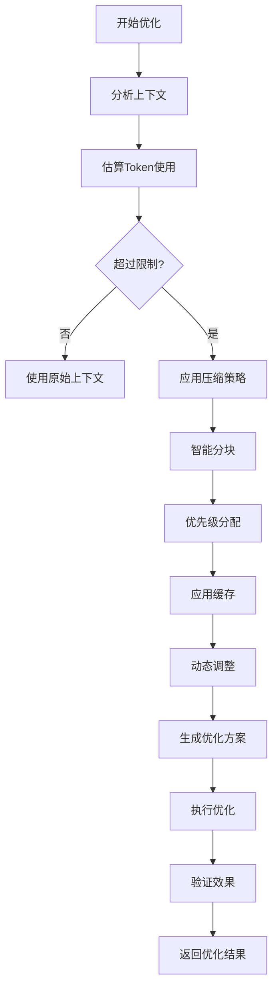

# Token优化技能

## 技能概述

本技能实现智能Token优化策略，最大化上下文窗口利用率，最小化Token浪费。基于everything-claude-code的token-optimization技能优化而来，针对标书编写项目定制。

---

## 核心功能

### 1. 上下文压缩

**功能描述：** 智能压缩上下文内容，保留关键信息

**压缩策略：**
```markdown
# 上下文压缩策略

## 文档压缩
- 保留标题结构
- 保留关键数据
- 保留重要结论
- 压缩冗余描述
- 移除格式标记

## 代码压缩
- 保留函数签名
- 保留关键逻辑
- 压缩注释
- 移除空行
- 简化变量名

## 历史压缩
- 保留最近N轮对话
- 压缩旧对话为摘要
- 保留关键决策
- 移除重复内容
- 保留用户偏好
```

**压缩算法：**
```python
def compress_context(context, max_tokens):
    """
    压缩上下文内容
    
    Args:
        context: 原始上下文
        max_tokens: 最大Token数
        
    Returns:
        压缩后的上下文
    """
    # 估算Token数
    current_tokens = estimate_tokens(context)
    
    if current_tokens <= max_tokens:
        return context
    
    # 按优先级压缩
    compressed = context.copy()
    
    # 1. 压缩历史对话
    compressed = compress_history(compressed, max_tokens)
    
    # 2. 压缩文档内容
    compressed = compress_documents(compressed, max_tokens)
    
    # 3. 压缩代码内容
    compressed = compress_code(compressed, max_tokens)
    
    # 4. 压缩系统提示
    compressed = compress_system_prompt(compressed, max_tokens)
    
    return compressed

def compress_history(context, max_tokens):
    """压缩历史对话"""
    history = context.get("history", [])
    if not history:
        return context
    
    # 保留最近10轮对话
    recent_history = history[-10:]
    
    # 压缩旧对话为摘要
    old_history = history[:-10]
    summary = generate_history_summary(old_history)
    
    context["history"] = recent_history
    context["history_summary"] = summary
    
    return context

def compress_documents(context, max_tokens):
    """压缩文档内容"""
    documents = context.get("documents", [])
    if not documents:
        return context
    
    compressed_docs = []
    for doc in documents:
        compressed_doc = {
            "title": doc.get("title"),
            "structure": extract_structure(doc.get("content")),
            "key_points": extract_key_points(doc.get("content")),
            "data": extract_data(doc.get("content")),
            "compressed": True
        }
        compressed_docs.append(compressed_doc)
    
    context["documents"] = compressed_docs
    return context

def compress_code(context, max_tokens):
    """压缩代码内容"""
    code = context.get("code", [])
    if not code:
        return context
    
    compressed_code = []
    for code_block in code:
        compressed = {
            "language": code_block.get("language"),
            "functions": extract_functions(code_block.get("content")),
            "key_logic": extract_key_logic(code_block.get("content")),
            "compressed": True
        }
        compressed_code.append(compressed)
    
    context["code"] = compressed_code
    return context
```

### 2. 智能分块

**功能描述：** 将大任务智能分块，确保每块在Token限制内

**分块策略：**
```markdown
# 智能分块策略

## 文档分块
- 按章节分块
- 按逻辑单元分块
- 按Token预算分块
- 保持上下文连贯
- 保留引用关系

## 代码分块
- 按模块分块
- 按功能分块
- 按依赖关系分块
- 保持接口清晰
- 保留调用关系

## 任务分块
- 按步骤分块
- 按优先级分块
- 按依赖关系分块
- 保持任务完整
- 保留执行顺序
```

**分块算法：**
```python
def smart_chunk(content, max_tokens, chunk_overlap=0.1):
    """
    智能分块
    
    Args:
        content: 原始内容
        max_tokens: 每块最大Token数
        chunk_overlap: 块重叠比例
        
    Returns:
        分块列表
    """
    chunks = []
    current_chunk = []
    current_tokens = 0
    overlap_tokens = int(max_tokens * chunk_overlap)
    
    # 按段落分块
    paragraphs = split_into_paragraphs(content)
    
    for para in paragraphs:
        para_tokens = estimate_tokens(para)
        
        # 如果当前块加上新段落超过限制
        if current_tokens + para_tokens > max_tokens:
            # 保存当前块
            if current_chunk:
                chunks.append("\n".join(current_chunk))
            
            # 创建新块，保留重叠部分
            current_chunk = get_overlap_content(current_chunk, overlap_tokens)
            current_tokens = estimate_tokens("\n".join(current_chunk))
        
        # 添加段落到当前块
        current_chunk.append(para)
        current_tokens += para_tokens
    
    # 添加最后一块
    if current_chunk:
        chunks.append("\n".join(current_chunk))
    
    return chunks

def split_into_paragraphs(content):
    """分割为段落"""
    # 按空行分割
    paragraphs = content.split("\n\n")
    
    # 过滤空段落
    paragraphs = [p.strip() for p in paragraphs if p.strip()]
    
    return paragraphs

def get_overlap_content(chunk, overlap_tokens):
    """获取重叠内容"""
    if not chunk:
        return []
    
    # 从末尾开始保留内容
    overlap_chunk = []
    current_tokens = 0
    
    for para in reversed(chunk):
        para_tokens = estimate_tokens(para)
        
        if current_tokens + para_tokens > overlap_tokens:
            break
        
        overlap_chunk.insert(0, para)
        current_tokens += para_tokens
    
    return overlap_chunk
```

### 3. 优先级管理

**功能描述：** 根据内容重要性分配Token预算

**优先级规则：**
```json
{
  "priority_rules": {
    "system_prompt": {
      "priority": 1,
      "min_tokens": 500,
      "max_tokens": 2000,
      "description": "系统提示"
    },
    "user_request": {
      "priority": 2,
      "min_tokens": 100,
      "max_tokens": 5000,
      "description": "用户请求"
    },
    "active_document": {
      "priority": 3,
      "min_tokens": 1000,
      "max_tokens": 10000,
      "description": "当前文档"
    },
    "related_documents": {
      "priority": 4,
      "min_tokens": 500,
      "max_tokens": 5000,
      "description": "相关文档"
    },
    "history": {
      "priority": 5,
      "min_tokens": 500,
      "max_tokens": 3000,
      "description": "历史对话"
    },
    "code": {
      "priority": 6,
      "min_tokens": 500,
      "max_tokens": 5000,
      "description": "代码内容"
    }
  }
}
```

**分配算法：**
```python
def allocate_token_budget(context, max_tokens=200000):
    """
    分配Token预算
    
    Args:
        context: 上下文内容
        max_tokens: 最大Token数
        
    Returns:
        Token分配方案
    """
    allocation = {}
    remaining_tokens = max_tokens
    
    # 按优先级分配
    priorities = [
        ("system_prompt", 1),
        ("user_request", 2),
        ("active_document", 3),
        ("related_documents", 4),
        ("history", 5),
        ("code", 6)
    ]
    
    for content_type, priority in priorities:
        if content_type not in context:
            continue
        
        # 获取优先级规则
        rule = priority_rules.get(content_type, {})
        min_tokens = rule.get("min_tokens", 0)
        max_tokens = rule.get("max_tokens", remaining_tokens)
        
        # 分配Token
        allocated = min(max_tokens, remaining_tokens)
        allocated = max(min_tokens, allocated)
        
        allocation[content_type] = {
            "allocated": allocated,
            "priority": priority,
            "content": context[content_type]
        }
        
        remaining_tokens -= allocated
        
        if remaining_tokens <= 0:
            break
    
    return allocation
```

### 4. 缓存优化

**功能描述：** 缓存常用内容，减少重复Token使用

**缓存策略：**
```markdown
# 缓存优化策略

## 缓存内容
- 常用文档模板
- 常用代码片段
- 常用提示词
- 常用配置
- 常用术语

## 缓存键
- 内容哈希
- 内容类型
- 使用频率
- 最后使用时间
- 缓存大小

## 缓存策略
- LRU（最近最少使用）
- LFU（最不经常使用）
- 混合策略
- 智能预测
- 自适应调整
```

**缓存实现：**
```python
class TokenCache:
    def __init__(self, max_size=1000):
        self.cache = {}
        self.access_count = {}
        self.last_access = {}
        self.max_size = max_size
    
    def get(self, key):
        """获取缓存内容"""
        if key in self.cache:
            # 更新访问信息
            self.access_count[key] = self.access_count.get(key, 0) + 1
            self.last_access[key] = datetime.now()
            return self.cache[key]
        return None
    
    def put(self, key, value, estimated_tokens):
        """添加到缓存"""
        # 检查缓存大小
        if len(self.cache) >= self.max_size:
            self.evict()
        
        # 添加到缓存
        self.cache[key] = {
            "value": value,
            "tokens": estimated_tokens,
            "created_at": datetime.now()
        }
        self.access_count[key] = 1
        self.last_access[key] = datetime.now()
    
    def evict(self):
        """驱逐缓存项"""
        # 使用混合策略：LRU + LFU
        scores = {}
        for key in self.cache:
            lru_score = (datetime.now() - self.last_access[key]).total_seconds()
            lfu_score = self.access_count.get(key, 0)
            scores[key] = lru_score / (lfu_score + 1)
        
        # 驱逐得分最高的项
        evict_key = max(scores, key=scores.get)
        del self.cache[evict_key]
        del self.access_count[evict_key]
        del self.last_access[evict_key]
```

### 5. 动态调整

**功能描述：** 根据任务复杂度动态调整Token分配

**调整策略：**
```python
def dynamic_adjustment(context, task_complexity):
    """
    动态调整Token分配
    
    Args:
        context: 上下文内容
        task_complexity: 任务复杂度（1-10）
        
    Returns:
        调整后的分配方案
    """
    # 基础分配
    allocation = allocate_token_budget(context)
    
    # 根据复杂度调整
    if task_complexity > 7:
        # 高复杂度：增加文档和代码配额
        allocation["active_document"]["allocated"] *= 1.5
        allocation["code"]["allocated"] *= 1.5
    elif task_complexity < 4:
        # 低复杂度：减少文档和代码配额
        allocation["active_document"]["allocated"] *= 0.7
        allocation["code"]["allocated"] *= 0.7
    
    # 确保不超过总限制
    total_allocated = sum(a["allocated"] for a in allocation.values())
    if total_allocated > 200000:
        scale = 200000 / total_allocated
        for a in allocation.values():
            a["allocated"] *= scale
    
    return allocation
```

---

## 工作流程

### Token优化流程



---

## 配置参数

```json
{
  "skill_name": "Token优化",
  "skill_version": "1.0.0",
  "enabled": true,
  "config": {
    "max_tokens": 200000,
    "compression": {
      "enabled": true,
      "strategy": "smart",
      "target_ratio": 0.7
    },
    "chunking": {
      "enabled": true,
      "chunk_size": 50000,
      "overlap_ratio": 0.1
    },
    "priority": {
      "enabled": true,
      "rules": "priority_rules"
    },
    "caching": {
      "enabled": true,
      "strategy": "hybrid",
      "max_size": 1000
    },
    "dynamic_adjustment": {
      "enabled": true,
      "complexity_threshold": 7
    }
  },
  "metrics": {
    "track_usage": true,
    "track_savings": true,
    "track_efficiency": true
  }
}
```

---

## 使用示例

### 示例1：优化大型文档上下文

**输入：**
```python
context = {
    "system_prompt": "...",  # 1000 tokens
    "user_request": "生成需求规格说明书",  # 50 tokens
    "active_document": "...",  # 50000 tokens
    "related_documents": ["...", "..."],  # 30000 tokens
    "history": ["...", "...", "..."],  # 10000 tokens
    "code": ["...", "..."]  # 5000 tokens
}

# 总计：~96050 tokens
```

**优化过程：**
```python
# 1. 压缩上下文
compressed = compress_context(context, max_tokens=200000)

# 2. 智能分块
chunks = smart_chunk(compressed["active_document"], max_tokens=50000)

# 3. 优先级分配
allocation = allocate_token_budget(compressed, max_tokens=200000)

# 4. 应用缓存
cached = apply_cache(allocation)

# 5. 动态调整
optimized = dynamic_adjustment(cached, task_complexity=5)
```

**优化结果：**
```json
{
  "original_tokens": 96050,
  "optimized_tokens": 45000,
  "savings": 51050,
  "savings_ratio": 0.53,
  "allocation": {
    "system_prompt": 1000,
    "user_request": 50,
    "active_document": 30000,
    "related_documents": 10000,
    "history": 3000,
    "code": 950
  }
}
```

---

## 性能指标

### 优化效率
- **压缩速度：** ≥ 10000 tokens/秒
- **分块速度：** ≥ 50000 tokens/秒
- **分配速度：** ≥ 1000项/秒
- **缓存速度：** ≥ 10000次/秒

### 优化效果
- **Token节省率：** ≥ 40%
- **信息保留率：** ≥ 95%
- **性能提升：** ≥ 30%
- **成本降低：** ≥ 35%

---

**技能版本：** V1.0
**最后更新：** 2026年3月13日
**维护人员：** AI助手
**来源参考：** everything-claude-code/token-optimization
