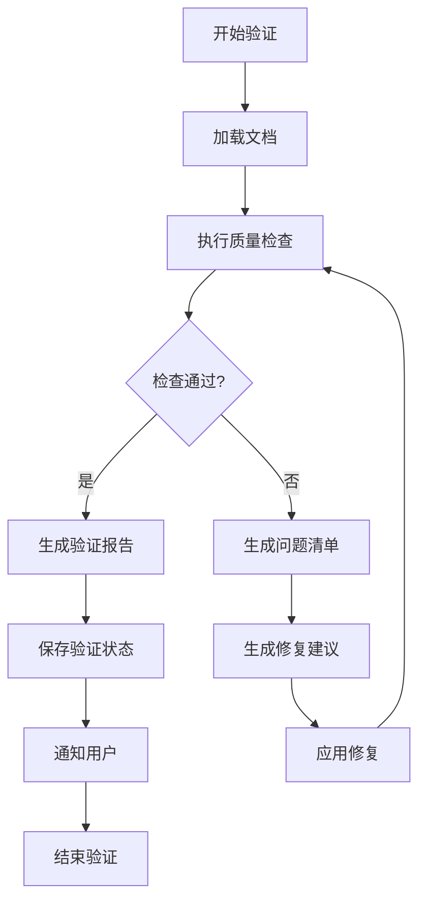

# 验证循环技能

## 技能概述

本技能实现持续验证循环，确保标书文档的完整性和准确性。基于everything-claude-code的verification-loop技能优化而来，针对中国政府采购标书验证场景定制。

---

## 核心功能

### 1. 自动质量检查

**功能描述：** 自动检查标书文档的质量指标

**检查项目：**
```markdown
# 质量检查清单

## 内容完整性
- [ ] 包含所有必需章节
- [ ] 每个章节都有内容
- [ ] 没有空白章节
- [ ] 没有缺失的表格或图表

## 术语准确性
- [ ] 专业术语使用正确
- [ ] 术语使用一致
- [ ] 没有拼写错误
- [ ] 缩写词有说明

## 数据准确性
- [ ] 数据来源明确
- [ ] 数据计算正确
- [ ] 数据单位正确
- [ ] 数据逻辑合理

## 格式规范性
- [ ] 标题层级正确
- [ ] 列表格式统一
- [ ] 表格格式规范
- [ ] 段落缩进一致

## 合规性检查
- [ ] 符合法律法规
- [ ] 符合技术标准
- [ ] 符合采购程序
- [ ] 符合财务要求
```

### 2. 验收标准验证

**功能描述：** 验证文档是否满足验收标准

**验收标准模板：**
```json
{
  "acceptance_criteria": {
    "document_type": "需求规格说明书",
    "required_sections": [
      "项目概况",
      "技术要求",
      "实施方案",
      "验收标准"
    ],
    "quality_metrics": {
      "completeness": {
        "threshold": 0.95,
        "description": "内容完整性 ≥ 95%"
      },
      "accuracy": {
        "threshold": 0.98,
        "description": "数据准确性 ≥ 98%"
      },
      "consistency": {
        "threshold": 0.90,
        "description": "术语一致性 ≥ 90%"
      },
      "compliance": {
        "threshold": 1.0,
        "description": "合规性 100%"
      }
    }
  }
}
```

### 3. 自动修复建议

**功能描述：** 自动生成问题修复建议

**修复建议格式：**
```markdown
# 质量问题修复建议

## 问题1：章节缺失
**问题描述：** 缺少"验收标准"章节
**严重程度：** 🔴 高
**修复建议：**
1. 添加"验收标准"章节
2. 包含验收条件、验收方法、验收流程
3. 参考标准验收文档模板

## 问题2：术语不一致
**问题描述：** "数字化管理平台"和"数字管理平台"混用
**严重程度：** 🟡 中
**修复建议：**
1. 统一使用"数字化管理平台"
2. 全文查找替换不一致术语
3. 更新术语库

## 问题3：数据来源缺失
**问题描述：** 第3.2节数据无来源标注
**严重程度：** 🟡 中
**修复建议：**
1. 添加数据来源说明
2. 标注统计时间和范围
3. 提供数据引用链接
```

### 4. 持续验证

**功能描述：** 在文档编写过程中持续验证

**验证触发点：**
```markdown
# 验证触发点

## 阶段1：需求分析后
- 验证需求完整性
- 验证需求可行性
- 验证需求一致性

## 阶段2：内容规划后
- 验证大纲完整性
- 验证结构合理性
- 验证章节平衡性

## 阶段3：内容生成后
- 验证内容完整性
- 验证数据准确性
- 验证格式规范性

## 阶段4：初稿完成后
- 全面质量检查
- 合规性验证
- 验收标准验证

## 阶段5：最终版本前
- 最终质量检查
- 最终合规验证
- 最终验收验证
```

---

## 工作流程

### 验证循环流程



### 详细步骤

#### 步骤1：文档加载

**输入：** 文档路径或文档内容

**处理：**
1. 读取文档内容
2. 解析文档结构
3. 提取关键信息
4. 识别文档类型

**输出：** 文档元数据和结构信息

#### 步骤2：质量检查

**输入：** 文档元数据和结构信息

**处理：**
1. 内容完整性检查
2. 术语准确性检查
3. 数据准确性检查
4. 格式规范性检查
5. 合规性检查

**输出：** 检查结果和问题清单

#### 步骤3：结果评估

**输入：** 检查结果

**处理：**
1. 计算质量得分
2. 评估严重程度
3. 确定是否通过
4. 生成修复建议

**输出：** 验证报告

#### 步骤4：状态保存

**输入：** 验证报告

**处理：**
1. 保存验证状态
2. 更新质量历史
3. 记录问题模式
4. 生成质量趋势

**输出：** 保存的状态文件

#### 步骤5：用户通知

**输入：** 验证报告

**处理：**
1. 生成用户友好报告
2. 高亮关键问题
3. 提供修复建议
4. 设置后续行动

**输出：** 用户通知

---

## 质量评分系统

### 评分标准

```json
{
  "scoring": {
    "weights": {
      "completeness": 0.30,
      "accuracy": 0.25,
      "consistency": 0.20,
      "compliance": 0.15,
      "formatting": 0.10
    },
    "levels": {
      "excellent": {
        "range": [0.90, 1.0],
        "label": "优秀",
        "color": "green"
      },
      "good": {
        "range": [0.80, 0.90],
        "label": "良好",
        "color": "blue"
      },
      "acceptable": {
        "range": [0.70, 0.80],
        "label": "合格",
        "color": "yellow"
      },
      "poor": {
        "range": [0.60, 0.70],
        "label": "较差",
        "color": "orange"
      },
      "unacceptable": {
        "range": [0.0, 0.60],
        "label": "不合格",
        "color": "red"
      }
    }
  }
}
```

### 评分计算

```python
def calculate_quality_score(check_results):
    """
    计算质量得分
    
    Args:
        check_results: 检查结果字典
        
    Returns:
        质量得分和等级
    """
    weights = {
        "completeness": 0.30,
        "accuracy": 0.25,
        "consistency": 0.20,
        "compliance": 0.15,
        "formatting": 0.10
    }
    
    total_score = 0.0
    for metric, weight in weights.items():
        metric_score = check_results.get(metric, {}).get("score", 0.0)
        total_score += metric_score * weight
    
    # 确定等级
    if total_score >= 0.90:
        level = "excellent"
    elif total_score >= 0.80:
        level = "good"
    elif total_score >= 0.70:
        level = "acceptable"
    elif total_score >= 0.60:
        level = "poor"
    else:
        level = "unacceptable"
    
    return {
        "total_score": total_score,
        "level": level,
        "details": check_results
    }
```

---

## 配置参数

```json
{
  "skill_name": "验证循环",
  "skill_version": "1.0.0",
  "enabled": true,
  "config": {
    "auto_verify": true,
    "verify_interval": "on_change",
    "quality_threshold": 0.80,
    "strict_mode": false,
    "auto_fix": false,
    "save_history": true,
    "max_history": 50
  },
  "checks": {
    "completeness": {
      "enabled": true,
      "weight": 0.30,
      "threshold": 0.95
    },
    "accuracy": {
      "enabled": true,
      "weight": 0.25,
      "threshold": 0.98
    },
    "consistency": {
      "enabled": true,
      "weight": 0.20,
      "threshold": 0.90
    },
    "compliance": {
      "enabled": true,
      "weight": 0.15,
      "threshold": 1.0
    },
    "formatting": {
      "enabled": true,
      "weight": 0.10,
      "threshold": 0.90
    }
  },
  "notifications": {
    "on_pass": true,
    "on_fail": true,
    "on_warning": true,
    "summary_format": "detailed"
  }
}
```

---

## 使用示例

### 示例1：验证需求规格说明书

**用户输入：**
```
验证需求规格说明书_天津背街小巷诊断数字化管理平台_完整版.md
```

**技能输出：**
```markdown
# 验证报告

## 文档信息
- 文档名称：需求规格说明书_天津背街小巷诊断数字化管理平台_完整版.md
- 文档类型：需求规格说明书
- 验证时间：2026-03-13 15:30:00

## 质量得分
- 总得分：0.87
- 质量等级：良好 🟢

## 详细检查结果

### 内容完整性 (0.30权重)
- 得分：0.92
- 状态：✅ 通过
- 发现问题：1个
  - 缺少"性能指标"章节

### 数据准确性 (0.25权重)
- 得分：0.95
- 状态：✅ 通过
- 发现问题：0个

### 术语一致性 (0.20权重)
- 得分：0.88
- 状态：✅ 通过
- 发现问题：2个
  - "数字化管理平台"和"数字管理平台"混用
  - "诊断评估"和"诊断"混用

### 合规性 (0.15权重)
- 得分：1.0
- 状态：✅ 通过
- 发现问题：0个

### 格式规范性 (0.10权重)
- 得分：0.75
- 状态：⚠️ 警告
- 发现问题：3个
  - 部分表格格式不统一
  - 标题层级不一致
  - 段落缩进不统一

## 修复建议

### 高优先级
1. 添加"性能指标"章节
2. 统一术语使用

### 中优先级
3. 统一表格格式
4. 修正标题层级

### 低优先级
5. 统一段落缩进

## 后续行动
- [ ] 应用修复建议
- [ ] 重新验证文档
- [ ] 确认质量达标
```

### 示例2：验证技术要求文档

**用户输入：**
```
验证技术要求文档
```

**技能输出：**
```markdown
# 验证报告

## 文档信息
- 文档类型：技术要求文档
- 验证时间：2026-03-13 16:00:00

## 质量得分
- 总得分：0.78
- 质量等级：合格 🟡

## 详细检查结果

### 内容完整性 (0.30权重)
- 得分：0.85
- 状态：⚠️ 警告
- 发现问题：2个

### 技术准确性 (0.25权重)
- 得分：0.90
- 状态：✅ 通过

### 合规性 (0.15权重)
- 得分：0.95
- 状态：✅ 通过

### 格式规范性 (0.10权重)
- 得分：0.70
- 状态：⚠️ 警告

## 修复建议
[具体修复建议]
```

---

## 性能指标

### 验证效率
- **文档加载速度：** ≥ 10文档/秒
- **质量检查速度：** ≥ 10000字/秒
- **报告生成速度：** ≥ 5000字/秒

### 准确性指标
- **误报率：** ≤ 5%
- **漏报率：** ≤ 10%
- **准确率：** ≥ 90%

---

## 优化策略

### 持续优化
1. **学习错误模式**
   - 分析历史验证结果
   - 识别常见错误类型
   - 优化检查规则

2. **用户反馈优化**
   - 收集用户反馈
   - 调整评分标准
   - 优化修复建议

3. **技术更新**
   - 跟踪最新标准
   - 更新合规规则
   - 优化检查算法

### 性能优化
1. **并行检查**
   - 并行执行检查
   - 缩短验证时间
   - 提高吞吐量

2. **缓存优化**
   - 缓存检查结果
   - 避免重复检查
   - 提高响应速度

3. **增量验证**
   - 支持增量检查
   - 只检查变更部分
   - 减少验证时间

---

## 维护指南

### 日常维护
- 更新检查规则
- 优化评分标准
- 收集用户反馈
- 分析验证结果

### 定期维护
- 评估性能指标
- 优化算法参数
- 更新合规规则
- 清理历史数据

### 应急维护
- 修复验证错误
- 处理用户投诉
- 解决性能问题
- 恢复验证服务

---

## 附录

### A. 检查规则参考

#### 政府采购标书检查规则
```markdown
# 检查规则

## 法律法规
- 《政府采购法》第XX条
- 《招标投标法》第XX条
- 地方性法规第XX条

## 技术标准
- GB/T XXXX-XXXX
- 行业标准XXXX
- 地方标准XXXX

## 格式要求
- 字体：宋体/黑体
- 字号：小四号/五号
- 行距：1.5倍
- 页边距：上下2.5cm，左右2cm
```

### B. 质量等级说明

| 等级 | 得分范围 | 颜色 | 说明 |
|-----|---------|------|------|
| 优秀 | 0.90-1.0 | 🟢 绿色 | 质量优秀，可以直接提交 |
| 良好 | 0.80-0.90 | 🔵 蓝色 | 质量良好，建议小修后提交 |
| 合格 | 0.70-0.80 | 🟡 黄色 | 质量合格，需要修复问题后提交 |
| 较差 | 0.60-0.70 | 🟠 橙色 | 质量较差，需要大幅修改 |
| 不合格 | 0.0-0.60 | 🔴 红色 | 质量不合格，需要重新编写 |

---

**技能版本：** V1.0
**最后更新：** 2026年3月13日
**维护人员：** AI助手
**来源参考：** everything-claude-code/verification-loop
